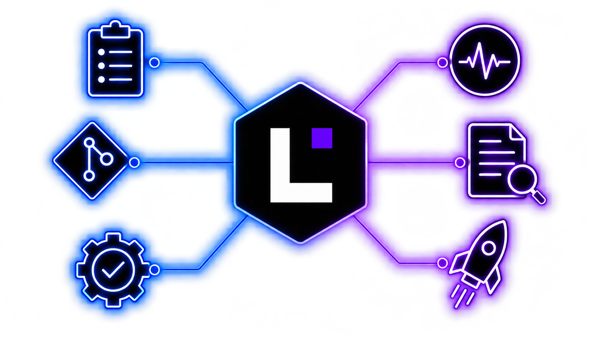

# Leitwerk

> The control unit for AI-driven software delivery.



`Leitwerk` is a process-centric control plane around embedded [Pi](https://pi.dev) workers. The server owns durable state. Production workers execute selected turns in Docker containers or Kubernetes pods. The UI shows every process in one shared shell.

## What it does

- **Process runtime:** code-defined process definitions composed of LLM, automatic, human, and external turns.
- **Durable control plane:** Fastify + SQLite + WebSocket, with the server as the only writer of durable state.
- **Disposable workers:** worker units embed `@earendil-works/pi-coding-agent` through the SDK and never access SQLite.
- **Extension model:** Integrations and process definitions load through the same extension loader.
- **Shared UI:** Svelte 5 app with a launcher-first home page and a process chronicle detail page.

## Packages

| Package | Description |
|---------|-------------|
| **[@leitwerk-dev/domain](packages/domain)** | Pure domain types and process state model |
| **[@leitwerk-dev/protocol](packages/protocol)** | HTTP, browser WebSocket, and shared projection contracts |
| **[@leitwerk-dev/worker-protocol](packages/worker-protocol)** | Server-worker IPC, transport, and snapshot contracts |
| **[@leitwerk-dev/process-sdk](packages/process-sdk)** | Extension and process-definition authoring API |
| **[@leitwerk-dev/extension-runtime](packages/extension-runtime)** | Extension discovery, catalog loading, and runtime definition assembly |
| **[@leitwerk-dev/watcher-utils](packages/watcher-utils)** | Shared watcher orchestration |
| **[@leitwerk-dev/external-writes](packages/external-writes)** | Idempotent external-write coordination |
| **[@leitwerk-dev/server](packages/server)** | Fastify API, SQLite persistence, worker supervision, extension host |
| **[@leitwerk-dev/worker-runners](packages/worker-runners)** | Local, Docker, and Kubernetes worker execution adapters |
| **[@leitwerk-dev/worker](packages/worker)** | Pi-backed selected-turn runtime and workspace manager |
| **[@leitwerk-dev/ui](packages/ui)** | Svelte 5 operator UI |
| **[@leitwerk-dev/test-support](packages/test-support)** | Fakes and integration-test helpers |

## Extensions

| Extension | Description |
|-----------|-------------|
| **[@leitwerk-dev/showcase-processes](extensions/showcase-processes)** | Demo processes plus a filesystem poem watcher used by the example config |
| **[@leitwerk-dev/models](extensions/models)** | Standard Pi API-key providers and config-defined custom gateways |
| **[@leitwerk-dev/coding](extensions/coding)** | Shared repo-change graph, forms, prompts, and Git finalization |
| **[@leitwerk-dev/git-ssh](extensions/git-ssh)** | Git-over-SSH credential profiles |
| **[@leitwerk-dev/forgejo-repo-change](extensions/forgejo-repo-change)** | Forgejo issue and UI-launched repository changes with pull-request delivery |
| **[@leitwerk-dev/process-analysis](extensions/process-analysis)** | Read-only analysis launcher for an existing process |
| **[@leitwerk-dev/telegram](extensions/telegram)** | Telegram bot bridge for process interaction |

## Documentation

Start with [docs/index.md](docs/index.md). It maps each document to its owned topic and suggests reading paths.

Build or serve the docs locally with MkDocs Material:

```bash
python3 -m pip install -r requirements-docs.txt
npm run docs:serve
npm run docs:build
```

Common entry points:

| Topic | Document |
|-------|----------|
| Architecture overview | [docs/arc42.md](docs/arc42.md) |
| Process and extension authoring | [docs/process-sdk.md](docs/process-sdk.md) |
| Server/worker runtime | [docs/server-worker-lifecycle.md](docs/server-worker-lifecycle.md) |
| Configuration | [docs/configuration.md](docs/configuration.md) |
| Local Docker deployment | [docs/docker-deployment-guide.md](docs/docker-deployment-guide.md) |
| CI, releases, and dependency updates | [docs/ci.md](docs/ci.md) |
| UI and streaming model | [docs/ui.md](docs/ui.md), [docs/websocket.md](docs/websocket.md) |
| Testing | [docs/testing.md](docs/testing.md) |
| Terminology | [docs/ubiquitous_language.md](docs/ubiquitous_language.md) |

## Quick Start

Follow [Run your first process](docs/introduction.md) for prerequisites, local-worker
configuration, model credentials, and the first launch. Leitwerk manages Pi resources;
workers do not import your ambient Pi directory.

For container isolation, use the [Docker](docs/docker-deployment-guide.md) or
[Kubernetes](docs/kubernetes-deployment-guide.md) guide. See
[Operate a process](docs/operator-guide.md) for reviews, Retry, Continue, and stopping work.

## Contributing

See [CONTRIBUTING.md](CONTRIBUTING.md) for license and DCO requirements, [GOVERNANCE.md](GOVERNANCE.md) / [MAINTAINERS.md](MAINTAINERS.md) for project governance, and [AGENTS.md](AGENTS.md) for architecture invariants for both humans and agents.

## Development

```bash
npm install          # Install all workspace dependencies
npm run dev          # Source-lane server/worker, Vite UI, and configured extension UI assets
npm run dev:parity   # Slower built-dist development lane
npm run build        # Turbo runtime build for packages and extensions
npm run build:ext-ui # Build extension browser assets/manifests only
npm run parity:build # Full dist/parity artifact build
npm run parity:start # Start the built server/worker/extensions lane
npm run lint         # Biome checks
npm run check:boundaries # Enforce packages/* -> extensions/* boundaries
npm run typecheck    # TypeScript project references
npm run docs:build   # Build MkDocs documentation
npm run test:parity  # Build and smoke-test the dist parity lane
npm run test:full    # Lint, built server/default-worker/parity smoke, boundary checks, typecheck, Vitest, and Playwright
```

Run pieces separately when needed:

```bash
npm run dev:server:source
npm run dev:ui
npm run dev:runtime     # dist-parity runtime watcher only
npm run dev:ext-ui      # dist-parity extension UI watcher only
npm run dev:server:dist # dist-parity server watcher only
```

`npm run dev` does not build or mutate `dist/**`. It starts the source-lane backend and Vite in parallel. Vite serves configured extension UI source manifests directly, so startup does not prime browser bundles or launch per-extension build watchers. Backend reloads exclude tests and extension UI implementation files; a source UI manifest change still reloads the catalog. Runtime edits pass an import plus Fastify-readiness preflight before replacing the healthy backend. Changes to the active configuration are preflighted and then restart the development session so the dynamic backend and browser source sets stay aligned. If the backend exits unexpectedly or does not become healthy within 30 seconds, the complete session stops instead of leaving Vite running against a dead proxy target. Use `npm run dev:parity` when validating watched production artifacts.

## Operational notes

- The backend starts at `server.host` / `server.port`; `npm run dev` falls forward to the next free backend port and keeps the UI proxy aligned.
- Set `LEITWERK_UI_PORT` when you need the Vite dev server to bind to a specific port.
- `/api/health` reports liveness. `/api/ready` reports readiness after startup reconciliation and extension start hooks.
- Set `workers.log_worker_events_to_stdout: true` for deep worker/Pi troubleshooting.
- Core packages under `packages/` must not import from `extensions/`.
- External writes from integrations must be idempotent and use the shared watcher utilities.
