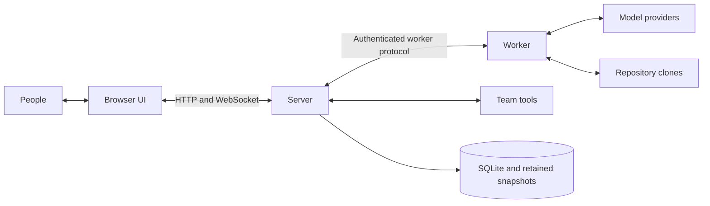

# Architecture

The server owns durable process state. Workers execute assigned turns and report
results. The browser displays server-owned state and submits operator commands.
Start with the [overview](overview.md) for the product model; this page describes
the boundaries maintainers must preserve.

## 1 Introduction and goals

Leitwerk coordinates code-defined AI workflows with human decisions and external
integrations. Its main quality goals are:

| Goal | Architectural response |
| --- | --- |
| Extensibility | Load processes, tools, providers, and watchers through extension contracts. |
| Visibility | Retain execution history and stream current activity to the browser. |
| Recovery | Reconcile durable process and worker state after interruption. |
| Isolation | Separate worker execution from server storage and credentials. |
| Ordered mutation | Sequence process inputs and serialize lifecycle changes per process. |

Operators launch, review, and recover work. Extension authors define business
behavior. Core maintainers own coordination, persistence, transport, and the shared UI.

## 2 Constraints

- POSIX environments only: macOS and Linux, not Windows.
- Core packages under `packages/` never import extensions, including in tests or types.
- The server is the only SQLite writer. Workers never access the database.
- Each process has one durable instance tree, even with several repositories or components.
- Per-process lifecycle mutations run under exclusive coordination. Extension reactions
  emitted during a mutation run after the lock is released.
- Configuration provides wiring and runtime defaults, not process graphs or actions.
- The deployment uses one server. Per-tenant isolation and multi-server coordination
  are not implied by authentication or idempotency.

The implementation uses Fastify, SQLite with Drizzle and `node:sqlite`, a Svelte 5
browser UI, and the Pi coding-agent SDK in workers.

## 3 Context

Extensions connect team tools through server-owned integration calls and polling.
Workers receive only the tools and credential material authorized for their work.
Repository code and model output are not trusted server configuration.

## 4 Solution strategy

Keep decisions pure where possible: graph validation, transition rules, and read-model
projection do not perform external writes. Server handlers, worker drivers, and
extension event handlers coordinate I/O around those rules.

Workers are disposable execution units, not owners of business state. Their retained
workspace and tooling can survive replacement, but that storage still needs independent
protection from loss. See [backup boundaries](operations.md).

## 5 Building blocks

| Boundary | Responsibility |
| --- | --- |
| `domain` | Durable entities and pure domain rules. |
| `protocol` | HTTP, browser frames, forms, launchers, and read-model contracts. |
| `worker-protocol` | Server-worker messages and snapshot exchange. |
| `process-sdk` | Code-defined processes and extension contracts. |
| `extension-runtime` | Discover extensions and assemble their catalogs and hosts. |
| `watcher-utils`, `external-writes` | Polling coordination and retry-safe external writes. |
| `worker-runners` | Local, Docker, and Kubernetes execution and read-only export. |
| `session-transfer`, `pi-session-transfer` | Portable exports and local Pi import/recovery. |
| `server`, `worker`, `ui` | Runtime composition and interaction. |

Provider and process behavior belongs to its extension, not to a privileged core
integration. UI extensions use [bounded renderer slots](extension-ui.md), not
arbitrary replacement of the application shell.

## 6 Runtime view

### Launch

1. A UI, programmatic, watcher, or scheduled source supplies launch intent and its
   admission policy, including idempotency where required.
2. The server creates a durable Launch Run, validates input, runs preparation checks,
   and resolves model and skill selections.
3. Process creation and correlated scheduling/deduplication records commit atomically.
4. Reactions run after commit and lock release. Failure here does not erase the process.
5. Startup proceeds asynchronously. Lease, readiness, and accepted-turn records establish
   startup facts; a Launch Run reports them but does not own that truth.

### Turn

1. A `TurnStartRecord` reserves one turn-record identity without counting an attempt.
2. Worker acceptance creates the turn record and increments its attempt exactly once.
3. The worker executes the authorized automatic or LLM turn. Optional LLM preparation
   checkpoints bounded JSON before prompting the model.
4. The server records a correlated outcome or failure. LLM terminal publication requires
   a session snapshot and durable acknowledgement.

See [Server and worker lifecycle](server-worker-lifecycle.md) for the protocol and
[LLM turn flow](llm-turn.md) for the sequence through browser updates.

### Process position and failure

`selectedTurnId` identifies business position. `lifecycleStatus` describes whether
the process is discovered, active, waiting, errored, completed, or aborted.
A failure preserves the selected turn and records an error; it does not route to
a synthetic failed turn. Only completed and aborted are terminal process states.

Retry starts a new attempt or recovers an unaccepted start. Continue is available
only for eligible saved LLM progress. Neither operation adds a process-defined action.

### Local session transfer

An operator creates an expiring bearer grant. A claim waits for accepted work and
automatic successors to become quiescent, then reserves the process while a read-only
export streams the workspace and primary session. Local import validates the archive
and commits a recoverable receipt. Local work then uses local Pi configuration, not
the server process. See [workspace transfer](process-workspace.md#5-local-pi-session-transfer).

## 7 Deployment

| Runner | Use | Boundary |
| --- | --- | --- |
| Local | Development and tests | Host subprocess; no container isolation. |
| Docker | Single-machine deployment | Worker container and retained process volume. |
| Kubernetes | Cluster deployment | Worker Pod in a process namespace with a retained PVC. |

Container isolation depends on operator-selected privileges and runtimes. Private
Docker can require broad authority; it is not a guarantee against all host effects.
See [Security](security.md), [Docker](docker-deployment-guide.md), and
[Kubernetes](kubernetes-deployment-guide.md).

## 8 Cross-cutting contracts

| Contract | Canonical reference |
| --- | --- |
| Acceptance, stale outcome rejection, retry, snapshots | [Worker lifecycle](server-worker-lifecycle.md) |
| Idempotent external writes and reconciliation | [Process SDK](process-sdk.md#typed-external-writes) |
| Managed, content-addressed non-secret Pi resources | [Process workspace](process-workspace.md#3-resource-aggregation) |
| Credential delivery and trust boundaries | [Security](security.md) |
| Browser snapshot authority and reconnect ordering | [WebSocket protocol](websocket.md) |
| Storage migration and disaster recovery | [Backup and upgrades](operations.md) |

## 9 Decisions

SQLite gives the singleton server one durable transaction boundary. Workers exchange
facts over authenticated IPC rather than accessing storage. Full repository clones
keep component work independent of host worktrees. Extension contracts keep provider
and business behavior outside core packages.

## 10 Quality scenarios

These are design expectations, not latency benchmarks or a test inventory:

- A repeated start acknowledgement does not create a second turn attempt.
- A stale worker outcome cannot mutate a newer attempt.
- Restart reconciles retained state without resetting configured storage.
- Browser reconnect rebuilds authoritative state and applies only newer live events.
- Repeating an external write reconciles remote identity instead of duplicating it.

Recovery preserves committed server state and available checkpoints. It does not
promise recovery of unuploaded output or lost process volumes.

## 11 Limits

Authentication is application-wide; it does not provide tenant isolation. External-write
serialization is scoped to one server process. Arbitrary process-to-process creation
is not supported. The constrained, operator-initiated ticket draft relation does not
imply a general child-process API. Parent lifecycle operations do not cascade to it.
See [Future work](future.md).

## 12 Terminology

Use the shared [terminology](ubiquitous_language.md). Definitions belong there;
protocol and behavioral rules belong in the references above.

Persistent [scoped settings](scoped-settings.md) separate extension-owned declarations
from server-owned storage and resolution. The worker boundary carries only
required non-secret values captured with a turn start.
