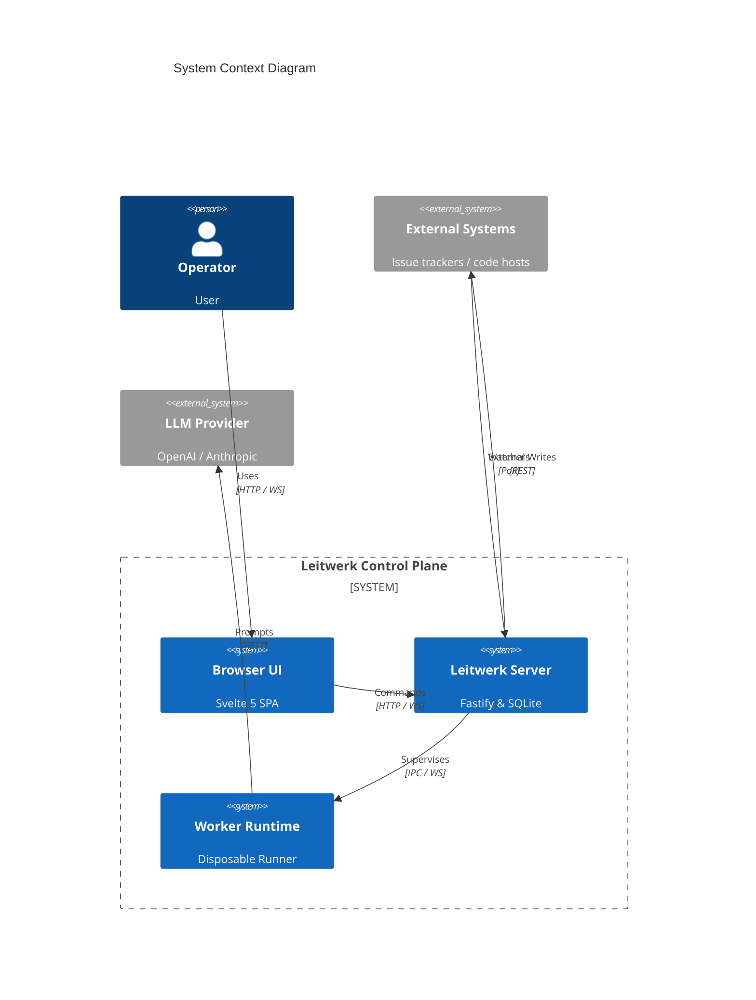
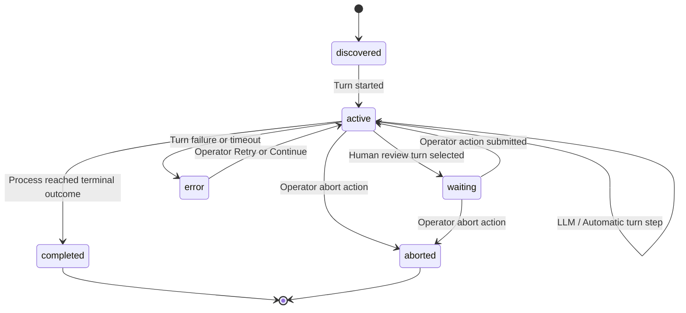

# Architecture

`Leitwerk` is the control unit for AI-driven software delivery. It is a process-centric control plane: the server owns all durable SQLite state, disposable workers execute step-by-step turns inside isolated git workspace clones, and the browser UI renders server-owned read models.

## 1 Introduction & Goals

Leitwerk orchestrates multi-turn AI workflows—from issue implementation and change-request polishing to local repository changes and cross-process handovers—with complete visibility, crash recovery, and human steering.

### 1.1 Requirements Overview

- **Durable Process Control:** Manage multi-step AI coding workflows that survive server restarts and worker crashes.
- **Isolated Execution:** Run worker-owned turns inside isolated containers (Docker, Kubernetes) or local subprocesses.
- **Human Steering:** Expose live WebSocket chronicles, review forms, and manual action steering to operators.
- **Code-Defined Extensibility:** Allow teams to build custom process graphs, watchers, and outcome tools using TypeScript extensions.

### 1.2 Quality Goals

| Priority | Goal | Description |
|---|---|---|
| 1 | **Extensibility** | Process graphs, launchers, watchers, and tools are code-defined via TypeScript SDK. |
| 1 | **Visibility** | Operators can inspect process state, worker output, and turn lineage in real time. |
| 2 | **Recovery** | Active processes survive server restarts and worker crashes without state loss. |
| 2 | **Isolation** | Worker execution is isolated in containers to constrain the blast radius of LLM errors. |
| 3 | **Determinism** | Processes consume durable inputs in strict FIFO order under exclusive process locks. |

### 1.3 Stakeholders

**Operators & Developers**  
Launch, monitor, steer, review, and recover AI processes via the Web UI or Telegram.

**Process & Extension Authors**  
Build custom processes, outcome tools, watchers, and external integrations using the Process SDK.

**System Developers**  
Maintain and extend the Leitwerk control plane, ProcessEngine, IPC protocol, and worker supervisors.

## 2 Architecture Constraints

- **Platform Target:** POSIX environments (macOS/Linux) only. Windows is not supported.
- **Monorepo Package Boundaries:** Core packages under `packages/` must **never** import from `extensions/`.
- **State Ownership:** The server is the exclusive source of truth for durable SQLite state. Workers are disposable and **never** access SQLite directly; all state flows over IPC.
- **Concurrency & Mutations:** Per-process state mutations run under server-side exclusive locks. Extension events emitted during mutations are deferred until after commit.
- **Technology Stack:**
  - **Server:** Fastify (HTTP + WebSocket via `@fastify/websocket`).
  - **Browser UI:** Svelte 5 SPA built with Vite.
  - **Database:** SQLite with Drizzle ORM + `node:sqlite` (synchronous).
  - **Worker Runtime:** `@earendil-works/pi-coding-agent` SDK embedded in worker processes.

## 3 System Scope and Context

| Actor / System | Role |
|---|---|
| **Operator** | Launches, reviews, steers, retries, and aborts processes via UI or Telegram. |
| **Browser UI** | Renders HTTP snapshots and applies real-time WebSocket chronicles. |
| **Server** | Owns durable state, ProcessEngine mutations, supervision, and safe external writes. |
| **Worker** | Executes worker-owned turns inside isolated workspace clones and uploads tree snapshots. |
| **External Systems** | Issue trackers and VCS providers monitored by extension-owned automated watchers and actions. |
| **LLM Provider** | Executes Pi model requests (e.g., OpenAI, Anthropic, Ollama). |

## 4 Solution Strategy

- **Functional Core, Imperative Shell:** Core process graph definitions, turn outcome transitions, and state reducers are pure and side-effect free. Fastify server handlers, worker drivers, and extension watchers form the imperative shell that orchestrates I/O and external writes.
- **Server-Owned Durable State:** SQLite is the single source of truth for process instances, turn records, input queues, and worker leases. Workers execute statelessly and communicate strictly via IPC.
- **Disposable Worker Isolation:** Execution turns run inside dedicated git repository clones inside isolated Docker containers or Kubernetes pods to constrain the blast radius of LLM actions.
- **Dynamic Extension Catalog:** Process definitions, watchers, outcome tools, and custom UI components are loaded dynamically via TypeScript extensions (`jiti`), keeping core packages extension-agnostic.

## 5 Building Block View

### 5.1 Monorepo Package Boundaries

Core packages under `packages/` maintain strict boundaries and **never** import from `extensions/`:

| Package | Responsibility |
|---|---|
| `domain` | Pure durable entity types (`ProcessInstance`, `ProcessTurnRecord`, `WorkerLease`). |
| `protocol` | HTTP, browser WebSocket, form, launcher, and read-model contracts. |
| `worker-protocol` | Server-worker IPC envelopes, codecs, transport constants, and snapshot exchange. |
| `process-sdk` | Fluent authoring API (`flow`) for process definitions, turns, and tools. |
| `extension-runtime` | Config-driven extension discovery, catalog loading, and host assembly. |
| `watcher-utils` | Provider-neutral watcher polling and reconciliation utilities. |
| `external-writes` | Idempotent external-write coordination (`ensureWrite`). |
| `worker-runners` | Local, Docker, and Kubernetes execution adapters. |
| `server`, `worker`, `ui` | Composition shells for the Fastify server, worker process, and Svelte 5 UI. |

## 6 Runtime View

### 6.1 Process Launch Phase

1. **Trigger & Resolution:** A manual launcher, automated watcher, or API adapter constructs the canonical launch configuration (`params`, `projects`, initial entry turn).
2. **ProcessEngine Coordination:** The server acquires exclusive coordination for the new process key to prevent concurrent creation collisions.
3. **Durable Seeding:** `ProcessLaunchExecutor` validates parameters, creates the `process_instances` row in SQLite, seeds repository metadata, and commits the initial process state.
4. **Post-Commit Reaction:** After commit and lock release, the server broadcasts process creation and schedules worker activation for the primary entry turn.

### 6.2 Turn Execution Phase

1. **Turn Preparation (`TurnStartRecord`):** ProcessEngine prepares the selected turn, reserves a `turnRecordId`, and issues a worker lease.
2. **Worker Acceptance:** The physical worker adopts the lease and acknowledges `worker.turn_started`. The server creates the `ProcessTurnRecord` and increments its attempt counter.
3. **Turn Execution & Tool Calls:** The worker executes code or prompts Pi in the workspace clone. An authored LLM preparation phase completes and checkpoints its bounded JSON result before Pi is prompted. Active turn tools (outcome tools, `ask_questions`) run in-flight.
4. **Snapshot Upload & Outcome Commit:** Before completing, the worker uploads the latest JSONL tree snapshot. The server commits the outcome (`worker.turn_outcome`), updates process state, and broadcasts WebSocket updates.

### 6.3 Process Lifecycle State Transitions

A process position consists of `selectedTurnId` plus `lifecycleStatus`. `error` is orthogonal to business position (a turn failure keeps `selectedTurnId` unchanged and moves status to `error`):

## 7 Deployment View

Leitwerk workers can be deployed using three distinct runner adapters:

- **Docker Runner (Production Default):** Spawns worker containers per process on a shared private Docker bridge network.
- **Kubernetes Runner:** Spawns worker pods in isolated Kubernetes process namespaces (see [Kubernetes](kubernetes-deployment-guide.md)).
- **Local Runner:** Spawns same-host worker subprocesses (used for local development via `npm run dev`).

## 8 Cross-Cutting Concepts

### 8.1 Error Model & Orthogonal Failure Position
Error is orthogonal to business position. When a turn fails or times out, `selectedTurnId` remains unchanged while `lifecycleStatus` transitions to `error`. A failed turn record is logged. Recovery commands (`Retry` or `Continue`) operate directly on failed turn lineages without mutating process graphs.

### 8.2 Idempotent External Writes (`ensureWrite`)
External writes to trackers and VCS providers must use `ensureWrite()` from `@leitwerk-dev/external-writes`. All external mutations are safe to retry across poll cycles and server restarts. Ticket adapters return a standard external receipt and reconcile provider-side identity after ambiguous outcomes; a durable-write row alone is not a substitute for a recoverable remote identity.

### 8.3 Turn-Record Correlation
Every worker outcome message carries `turnRecordId` and `turnId`. The server rejects outcomes that do not match the current expected turn record, preventing stale or abandoned worker branches from mutating state.

### 8.4 Content-Addressed Pi Resource Snapshots
The server builds immutable, content-addressed Pi resource bundles. Physical workers verify and materialize snapshots below the managed `pi.agent_dir`, ensuring workers never access ambient host files or unverified skills.

## 9 Architecture Decisions

- **Process-Centric Control Plane:** The server is the exclusive source of truth for durable state; workers are disposable execution units.
- **Fastify & Svelte 5 Stack:** Fastify provides high-performance REST and WebSocket servers; Svelte 5 SPA provides real-time UI chronicles.
- **SQLite & Drizzle ORM:** Synchronous `node:sqlite` ensures atomic, crash-safe state transactions.
- **Pi Coding Agent SDK:** `@earendil-works/pi-coding-agent` is embedded in workers as the core LLM execution engine.

## 10 Quality Scenarios

| ID | Quality Goal | Scenario |
|---|---|---|
| SC1 | **Extensibility** | A developer creates a new TypeScript extension with custom process graphs and outcome tools in under an hour using `@leitwerk-dev/process-sdk`. |
| SC2 | **Visibility** | An operator monitors a running process; live WebSocket updates render worker tool calls and chronicles in under 500ms. |
| SC3 | **Recovery** | The server process is hard-killed during an active worker turn. Upon restart, the server recovers durable SQLite state, re-adopts or respawns the worker, and resumes without progress loss. |
| SC4 | **Isolation** | An LLM agent generates invalid shell commands or errors inside a worker turn. The container boundary prevents host filesystem or SQLite corruption. |
| SC5 | **Determinism** | Multiple inputs arrive simultaneously. ProcessEngine queues inputs in FIFO order and processes mutations sequentially under exclusive locks. |

## 11 Risks and Technical Debt

- **Single-Provider SSO:** Current authentication supports one configured OIDC provider or native GitHub OAuth organization attribution; tenant isolation and per-process multi-tenant authorization remain future work.
- **Derived Process Creation:** Arbitrary process-to-process spawning remains out of scope. The server supports the constrained, UI-initiated `ticket_creation` relation: it atomically launches a generic child from a durable result and records immutable parent context. A ticket adapter may list sanitized destinations for that child. The server resolves the child's opaque destination choice into a server-owned snapshot immediately before approval and exposes it to the authorized integration tool without exposing credentials. Parent lifecycle operations never cascade to the child.

## 12 Glossary

- **ProcessInstance:** Durable record of process position (`selectedTurnId`, `lifecycleStatus`, `params`, `state`).
- **ProcessTurnRecord:** Execution lineage entry tracking turn attempts, outcome tools, and Pi entry provenance.
- **WorkerLease:** Server-owned lease record tracking worker assignment, heartbeats, and supervision.
- **Product:** Named markdown artifact published by one turn and consumed by another.
- **Launcher:** Canonical field schema and resolution logic for starting a process instance.
- **Watcher:** Event-driven background trigger that monitors external systems and triggers a launcher.
- **LaunchRun:** Durable, presentation-safe progress record for one launch attempt.

The server's Launch Coordinator is the single launch orchestration seam. UI, watcher, scheduled,
and startup-retry origins create Launch Runs through it. It sequences launcher checks, model and
skill preparation, process creation, title work, runner startup, worker readiness, and first-turn
acceptance. The process-detail read model independently projects startup from the correlated turn
start, worker lease, server-observed readiness, and accepted turn; Launch Run ordering cannot
select process startup state. Callers observe the durable HTTP read model and `launch.updated`
invalidations rather than runner mechanics.
