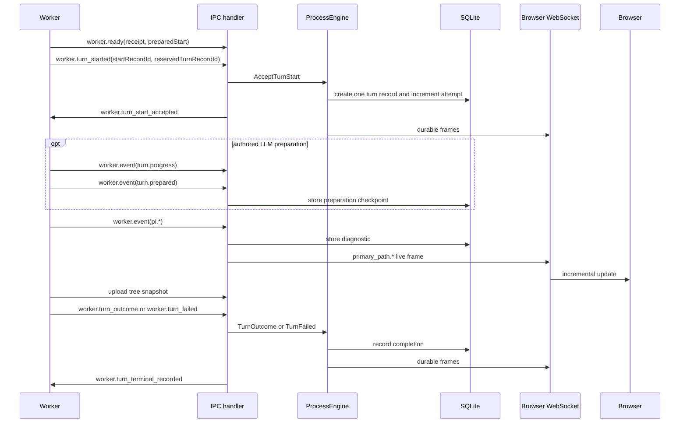

# LLM turn flow

An active LLM turn uses two server paths:

- lifecycle messages mutate durable process state through ProcessEngine;
- runtime events update diagnostics and the live browser projection directly.

## Preparation phase

An LLM turn may declare deterministic preparation. After start acceptance, the worker runs this
phase before prompt evaluation. Preparation can call only the turn's authorized integration tools
and can emit the same durable progress reports as an automatic turn. Its bounded, non-secret JSON
result is emitted as `turn.prepared` and passed to the prompt as `ctx.prepared`.

A replacement worker reuses a checkpoint stored for the same running turn record. Continue reuses
the failed attempt's checkpoint; Retry creates a new attempt and runs preparation again. If no
checkpoint reached the server before a worker failure, deterministic preparation may run again.
Preparation failure records the owning LLM turn as failed without prompting Pi.

## Durable path

These messages use ProcessEngine operations:

- accepted `worker.turn_started` / `worker.turn_start_accepted`;
- `worker.turn_outcome`;
- `worker.turn_failed`.

```text
Correlate the worker message
 → decide under the process lock
 → commit durable state
 → release the lock
 → dispatch reactions
```

This path updates process state, turn records, annotations, products, events, and worker intent in a coordinated transaction.

## Runtime path

`worker.event` carries turn-local Pi activity such as stream deltas, tool lifecycle, compaction, retries, errors, labels, and usage.

The server accepts only correlated turn activity. It retains the diagnostic event,
updates supported live projections, and broadcasts browser frames. Tool calls retain
a canonical identity across reconnects.

Runtime events do not enter ProcessEngine because they do not change durable business position.

`execution.inspection` observations use the same IPC path but are retained separately
from diagnostic logs and browser stream frames. After acceptance, the worker records
supplied product versions and reads of those products. Each Pi model call records
the effective model-facing context after conversion and tool assembly: model,
ordered messages, system prompt, appended instructions, loaded context files, and
available tool definitions. Provider request options and renderer-only details are
excluded. This is a model-context record, not a provider-wire request.

Each call is a separate revision. Compaction, continuation, and worker replacement
do not overwrite earlier evidence. Session entry identities correlate committed
messages with live activity where the SDK exposes them; ambiguous conversion
matches retain content without claiming an entry identity. Missing historical
evidence is never reconstructed from current workflow configuration.

Session-global Pi events and unknown SDK events are stored as `worker.trace`, not turn-local `pi.*` activity.

## Sequence



The tree snapshot must upload before outcome or failure. An upload failure becomes an infrastructure failure. After upload, the worker retains the terminal fact, remains busy, and replays it after timeout or reconnect until `worker.turn_terminal_recorded` confirms the durable write. Duplicate terminal facts are idempotent. A server rejection or exception is recorded as an infrastructure turn failure instead of leaving the process active indefinitely. When the worker already produced a result entry, the failure preserves that entry and continuation metadata so the UI exposes Continue alongside Retry.

Before acceptance, LLM bootstrap only inspects the retained tree to produce `preparedStart`; it must not prompt Pi or mutate the tree. Acceptance validates that preparation and records its path and fork provenance. Post-acceptance execution uses that recorded preparation rather than selecting a different path.

## Browser rebuild

The detail view uses:

1. `GET /api/processes/:instanceId/ui-snapshot` for initial and reconnect state;
2. `primary_path.*` frames for live changes;
3. `GET /api/processes/:instanceId/turn-records/:turnRecordId/reasoning` for one expanded running or completed turn.

Event ingestion atomically persists the event, its monotonic sequence, and a compact turn summary. The summary contains at most 1,024 characters each of recent reasoning and assistant text, current tool status, counts, usage, and `throughEventSequence`. It contains no trace items, tool arguments, or tool results.

Session-derived previews and prompt/continuation evidence are stored when snapshots
are accepted. Missing projections show turn status until available. Initial page
requests use compact stored summaries; they do not replay event history or parse
session trees. The same boundary applies after restart.

An expanded live trace reads all recorded activity for the selected `turnRecordId`, including multiple LLM calls and operational events. Detail responses distinguish `live` and `committed` state and capture their event boundary before asynchronous work. The browser buffers `pi.*` frames during recovery and applies only later sequences once. Compact refreshes cannot shorten expanded history.

## Contract boundaries

- [Server and worker lifecycle](server-worker-lifecycle.md) owns ProcessEngine, IPC, snapshots, and recovery.
- [Agent tools](agent-tools.md) owns completion-tool validation.
- [Browser WebSocket](websocket.md) owns frame schemas and reconnect ordering.
- [UI chronicle](ui.md) owns rendering and interaction.
