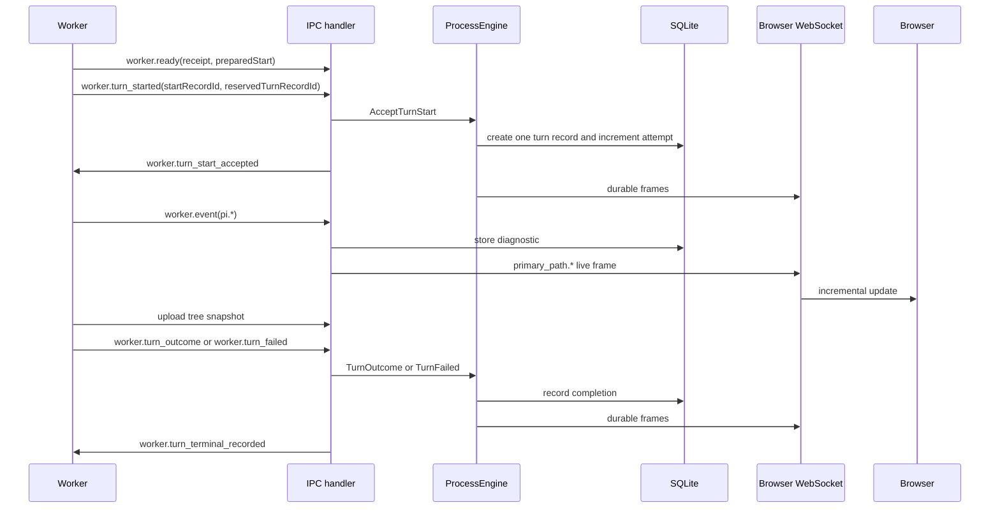

# LLM Turn Flow

An active LLM turn uses two server paths:

- lifecycle messages mutate durable process state through ProcessEngine;
- runtime events update diagnostics and the live browser projection directly.

## Durable path

These messages use ProcessEngine operations:

- accepted `worker.turn_started` / `worker.turn_start_accepted`;
- `worker.turn_outcome`;
- `worker.turn_failed`.

```text
IPC handler
 -> processEngine.run(Operation, input)
 -> decide
 -> record
 -> lock release
 -> dispatch reactions
```

This path updates process state, turn records, annotations, products, events, and worker intent in a coordinated transaction.

## Runtime path

`worker.event` carries turn-local Pi activity such as stream deltas, tool lifecycle, compaction, retries, errors, labels, and usage.

The IPC handler:

1. checks active turn correlation;
2. canonicalizes tool-call identity;
3. stores the raw diagnostic event;
4. updates the reconnectable active-turn projection when supported;
5. broadcasts normalized `primary_path.*` frames.

Runtime events do not enter ProcessEngine because they do not change durable business position.

Session-global Pi events and unknown SDK events are stored as `worker.trace`, not turn-local `pi.*` activity.

## Sequence



The tree snapshot must upload before outcome or failure. An upload failure becomes an infrastructure failure. After upload, the worker retains the terminal fact, remains busy, and replays it after timeout or reconnect until `worker.turn_terminal_recorded` confirms the durable write. Duplicate terminal facts are idempotent. A server rejection or exception is recorded as an infrastructure turn failure instead of leaving the process active indefinitely. When the worker already produced a result entry, the failure preserves that entry and continuation metadata so the UI exposes Continue alongside Retry.

Before acceptance, LLM bootstrap only inspects the retained tree to produce `preparedStart`; it must not prompt Pi or mutate the tree. Acceptance validates that preparation and records its path and fork provenance. Post-acceptance execution uses that recorded preparation rather than selecting a different path.

## Browser rebuild

The detail view uses:

1. `GET /api/processes/:instanceId/ui-snapshot` for initial and reconnect state;
2. `primary_path.*` frames for live changes;
3. `GET /api/processes/:instanceId/turn-records/:turnRecordId/reasoning` for one expanded completed turn.

The compact snapshot includes `rebuiltAt`. After a rebuild, the browser applies only buffered frames with a newer `sentAt`.

Raw `pi.*` frames are diagnostic compatibility data. The default detail view does not use them as its state model.

## Contract boundaries

- [Server and worker lifecycle](server-worker-lifecycle.md) owns ProcessEngine, IPC, snapshots, and recovery.
- [Agent tools](agent-tools.md) owns completion-tool validation.
- [Browser WebSocket](websocket.md) owns frame schemas and reconnect ordering.
- [UI chronicle](ui.md) owns rendering and interaction.
