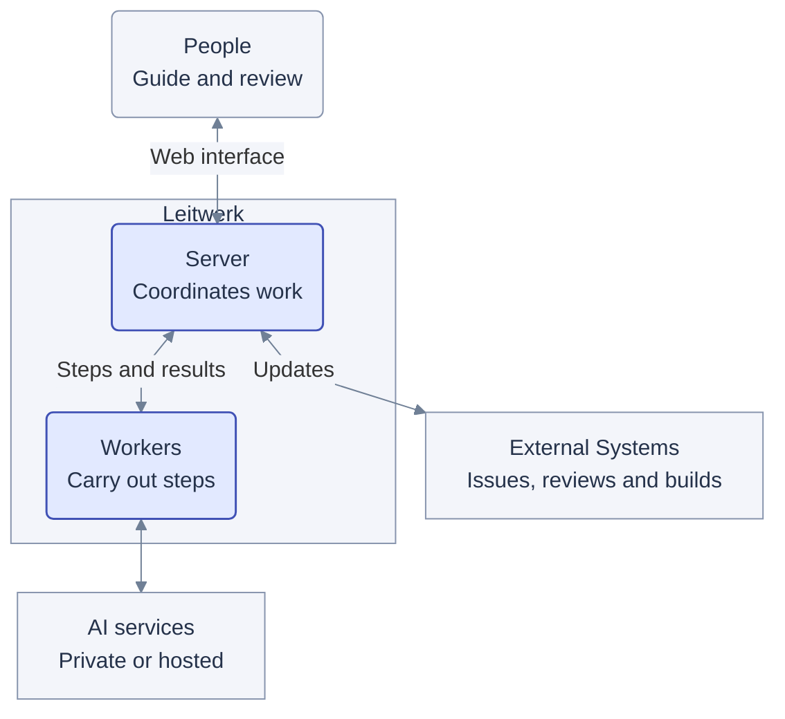

# Leitwerk overview

Leitwerk standardizes AI-assisted workflows for teams. Teams define the steps and where people must review or approve results. Leitwerk coordinates the work, tracks progress, and makes results visible.

## Example workflows

- **Standardized software delivery:** request → plan → approval → implementation → tests → review.
- **Monitoring:** check logs → analyze → create ticket.
- **Issue triage:** incoming issue → analysis → proposed action → team decision.

## Choose the model for each step

Each step, called a **turn**, can use a different AI model. A privately hosted model can handle sensitive information, while a state-of-the-art model makes code changes.

## Who does what

- **People** start work, provide guidance, and review results through a web interface. They can stop work or retry failed steps.
- **The Leitwerk server** coordinates the workflow. It saves progress, assigns steps to workers, and responds to decisions and updates from other systems.
- **Workers** carry out assigned steps using AI and other tools, then report their results to the server.

## Connected systems

Leitwerk connects to AI services and existing team tools, such as issue trackers, code repositories, code-review tools, and build systems.

Each workflow uses the connections it needs. Leitwerk coordinates these systems; it does not replace them.
