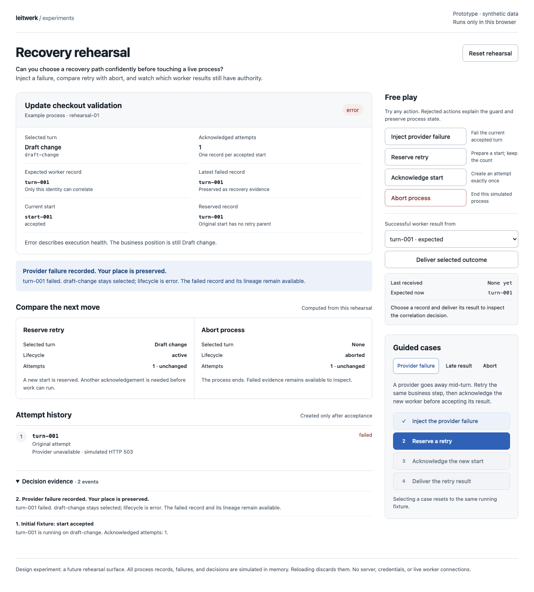
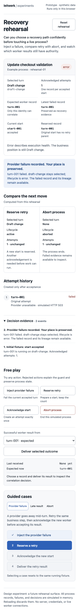

# Recovery rehearsal

A throwaway, browser-only experiment for choosing a recovery action before touching a live process.

**Design question:** Can operators predict what retry and abort will change when the business position, lifecycle, start reservation, and accepted attempt are shown separately?

Open `index.html` directly in a modern browser. No installation, server, credentials, or network access is required. All records are synthetic and live in memory. Reload or **Reset rehearsal** discards the simulation.

## Interactions

The free-play controls inject a provider failure, reserve a retry, acknowledge its start, abort the process, and deliver a success from a chosen worker record. Invalid actions stay available so the operator can inspect the rejection reason. The comparison projects retry and abort from the same failed state without applying either choice.

Three guided cases reset to a running fixture:

1. **Provider failure:** fail → reserve retry → acknowledge → deliver the current result. The selected turn stays `draft-change` during failure and retry; only the accepted result advances to the synthetic `review` action turn.
2. **Late result:** fail → reserve → send the reserved result before acceptance → acknowledge → deliver the old result → deliver the current result. Premature and stale results cannot advance the process.
3. **Abort:** fail → abort → try retry → deliver an old result. Abort clears selection and execution while preserving failed history.

Free play also exposes repeated acknowledgements and aborting between reservation and acceptance. Repeated acceptance does not add an attempt. A late acknowledgement after abort cannot resume the process.

`RecoveryModel` is a pure reducer and projection module in the inline script. DOM rendering and event handling sit below it. Comparison values, counts, lineage, record options, and decision evidence derive from simulation state.

## Integration seams

These are reference points for a future production proposal; this branch does not change them:

- `packages/domain/src/domain-model.ts`: `ProcessInstance`, `ProcessTurnRecord`, and `TurnStartRecord` contracts.
- `packages/server/src/process-engine/writes/build-turn-failed-writes.ts`: failures preserve selection and the accepted start anchor while parking lifecycle at `error`.
- `packages/server/src/process-engine/writes/build-recovery-start-writes.ts`: retry reserves an identity and links recovery to the failed record.
- `packages/server/src/process-engine/ops/accept-worker-turn-start.ts`: acknowledged acceptance creates the durable attempt.
- `packages/server/src/domain-logic/turn-record-guards.ts`: current-record correlation rejects stale results.
- `packages/server/src/process-engine/writes/build-process-abort-writes.ts`: abort clears selection and supersedes running work.
- `packages/ui/src/chronicle/components/ChronicleProcessErrorSection.svelte`: possible entry point for an operator rehearsal.
- `docs/server-worker-lifecycle.md`, acceptance and recovery: intended runtime contract.

The visual treatment follows `packages/ui/PRODUCT.md` and `packages/ui/DESIGN.md`.

## Validation performed

- Extracted the inline script and ran `node --check`; passed.
- Ran `git diff --check`; passed.
- Opened the actual HTML in isolated `agent-browser` session `idea-01` and completed all three guided cases.
- Observed attempts remain 1 at reservation, become 2 at acknowledgement, and remain 2 after a repeated acknowledgement.
- Observed a premature `turn-002` result rejected against no accepted record, and historical `turn-001` rejected against expected `turn-002`. The current accepted result advanced to `review`.
- Observed abort reject retry and old results. Also aborted a pending retry and observed a late acknowledgement rejected with only 1 attempt retained.
- Completed provider recovery at a 390px mobile viewport. Arrow-key navigation selected and focused the next scenario tab. Document width remained 390px; no horizontal overflow.
- Browser reported no JavaScript errors. Captured and visually inspected both screenshots.

The standalone helper falls under scoped validation in `AGENTS.md` section 7. Application packages, dependencies, and build/runtime configuration are unchanged; `npm run test:full` was not run.

## Limits and provisional learning

This models one LLM turn and one review action with sequential events. It does not simulate SQLite, workers, leases, network timing, startup preparation failure, cleanup handlers, saved-leaf continuation, model changes, or concurrent mutations. Retry preparation is assumed to succeed. Aborted start metadata is summarized as no current execution; production retains durable start history.

The simulator accepts success only for a running record and rejects a second terminal result after failure. This is a rehearsal simplification: production terminal acknowledgement and replay handling involve additional orchestration beyond record correlation. Do not copy this reducer into the runtime as a replacement for its guards.

The browser checks support the state model: displaying the reservation separately makes the attempt-count boundary inspectable, and showing received versus expected identity explains stale-result rejection. Whether this improves operator confidence needs user testing. No production integration decision has been made.

Mobile recovery comparison

