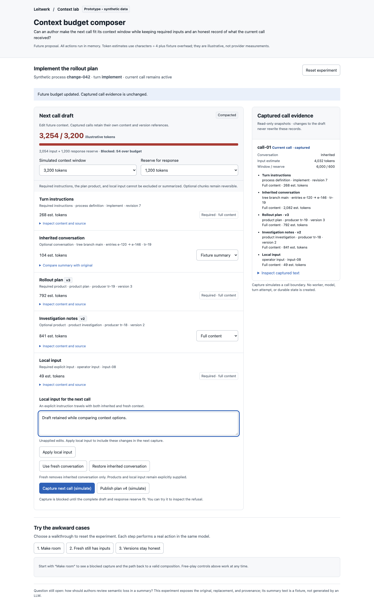
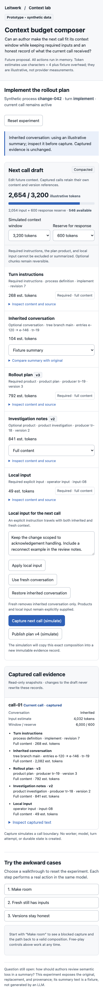

# Context budget composer

A throwaway, self-contained experiment for authors composing a future model call.

**Design question:** Can authors reduce context to fit a model window while preserving required inputs, explicit product versions, and immutable evidence of what earlier calls actually received?

Open `index.html` directly in a browser. No install, server, credentials, or application state is needed. Reload or choose **Reset experiment** to discard the in-memory simulation.

## What works

- Inspect inherited conversation, turn instructions, supplied products, and local input with source references and full text.
- Retain, exclude, or replace optional chunks with visible fixture summaries. Required chunks keep their full content.
- Choose a simulated context window and response reserve. Capture refuses any composition whose illustrative input estimate plus reserve exceeds the window.
- Select fresh context while retaining explicitly supplied products and local input.
- Publish a synthetic plan v4, explicitly adopt it, and compare its captured version with the unchanged v3 record.
- Capture future-call evidence as independent copies. Existing call content, estimates, provenance, and budget remain inspectable.

The token estimate is `ceil(text.length / 4) + 24` per included chunk, plus the selected response reserve. It is an illustrative heuristic with fixture overhead, not a tokenizer, billing estimate, or provider request measurement.

## Walkthroughs

1. **Make room:** select the walkthrough, attempt capture with a 3,200-token window, summarize conversation, exclude optional investigation notes, and capture again. The initial 4,632-token composition is refused; the final composition uses 1,813 illustrative tokens including reserve.
2. **Fresh still has inputs:** select fresh conversation, attempt to exclude the required plan, then capture. The refusal preserves the plan. The new snapshot includes plan v3, investigation v2, and local input without inherited conversation.
3. **Versions stay honest:** publish v4, adopt it explicitly, then capture. Publication alone leaves the draft pinned to v3. The old snapshot stays on v3 and the new one records v4.

Free-play controls remain available between steps. Starting another walkthrough resets the state, so sequences remain reproducible.

## Integration seams

These are investigation points for a later implementation; this prototype changes none of them.

- `packages/process-sdk/src/types.ts`: `TurnContextMode` expresses authored `full`, `compacted`, `fresh`, and `fresh_seeded` semantics. Arbitrary per-chunk composition would require an explicit extension to that contract.
- `packages/process-sdk/src/flow.ts`: author-facing `freshPrimary()` and `freshSeededPrimary()` configuration; product declarations determine required versus optional supply.
- `packages/worker/src/turn-tree-strategy.ts`: actual conversation branch selection. Fresh context must not be confused with removing independently supplied products.
- `packages/worker/src/pi-inspection.ts`: model-facing context capture for each actual call. A future composer must preserve those immutable records.
- `packages/domain/src/execution-inspection.ts`: evidence types and product provenance.
- `packages/server/src/process-inspection.ts`: recorded context origin and inherited conversation boundaries.
- `packages/ui/src/pages/process-detail/inspector/ProcessInspector.svelte`: current inspection surface where a future draft could be distinguished from recorded evidence.
- `docs/llm-turn.md` and `docs/process-sdk.md`: the contracts for per-call evidence and product supply.

## Validation

Validated in an isolated `agent-browser --session idea-02` browser:

- All three guided walkthroughs completed through real browser clicks.
- Oversized capture refused with a 1,432-token excess; reduced composition captured at 1,813 / 3,200 illustrative tokens.
- Required-plan removal refused. Fresh snapshot retained both supplied products and local input, and omitted inherited conversation.
- Publishing v4 left the draft at v3 until adoption. Captured versions were `[3, 4]`; the serialized first snapshot was byte-for-byte unchanged.
- Desktop screenshot at 1440 × 1100 and mobile screenshot at 390 × 844 were opened and visually inspected. Mobile document width was 390px with no horizontal overflow.
- No browser errors were reported. Extracted inline JavaScript passed `node --check`; `git diff --check` passed.

Screenshots show a summarized future draft next to the original captured evidence:

Mobile

## Limits and provisional learning

This is synthetic in-memory behavior, not a production integration. Capturing creates no worker, durable record, turn attempt, or actual model call. Summaries are fixed fixture text. No tokenizer, provider limit discovery, redaction, concurrent editing, or persistence is implemented. Application full validation is outside this standalone experiment's scope.

The experiment supports separating future composition from recorded evidence: a fresh conversation can still have explicit product inputs, and a product publication needs explicit adoption to avoid silently changing a draft. Required-content overflow needs a larger window or an authored contract change; summarization cannot erase required inputs. A remaining design question is how authors should review semantic loss before accepting an actual generated summary.

The standalone HTML also passes the repository Biome check.
