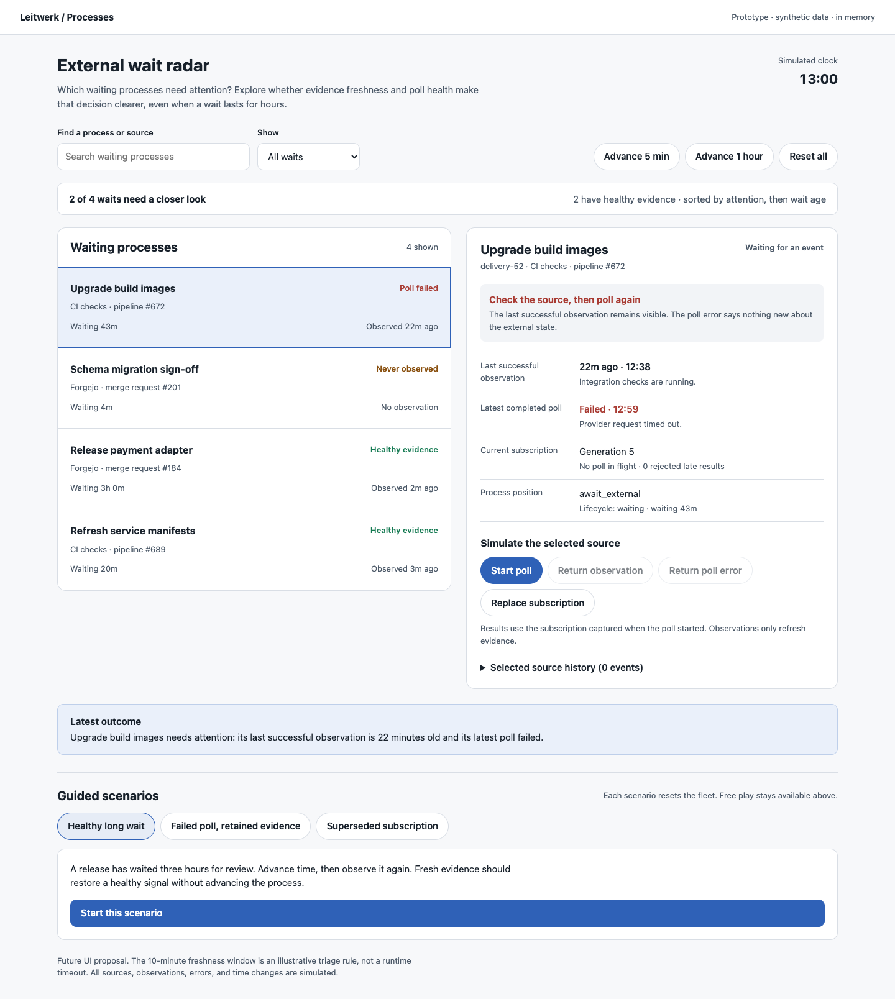
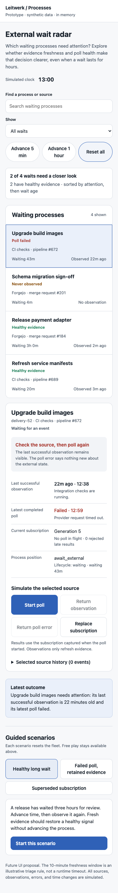

# External wait radar

A throwaway prototype for fleet-level external-wait triage. Open `index.html` in a browser; no server, dependencies, credentials, or installation are needed. All records and timestamps are synthetic and all changes live in memory.

The design question is whether operators can identify waits that need attention when the interface separates wait duration, successful observation freshness, and the latest polling result. A three-hour wait with current evidence can be healthy. A failed request cannot replace the last known external state.

## Try it

Select a process to inspect its evidence and simulated source. Search by process name or source, or filter to waits needing attention, healthy evidence, or subscriptions never observed. Selection remains available when a filter hides its row, with an explicit note in the detail panel.

Use **Start poll**, then return an observation or error. A poll captures the current subscription generation. **Replace subscription** creates a new generation while retaining any in-flight request, allowing a late response to be rejected. **Advance 5 min** and **Advance 1 hour** change evidence freshness without changing process position. **Reset all** restores the fleet.

Three guided scenarios reset the data and expose the same actions as ordered steps:

1. **Healthy long wait:** advance the three-hour review wait by one hour, start a poll, and receive waiting state. Its evidence becomes healthy while its wait reaches four hours.
2. **Failed poll, retained evidence:** fail another request and inspect the retained 12:38 observation beside the 13:00 error. Recover with a successful poll; the error clears and the observation updates.
3. **Superseded subscription:** start a generation-7 request, replace the subscription with generation 8, and deliver the old result. It is rejected; the current subscription remains never observed until its own request succeeds.

The `Radar` model is a pure reducer plus classification and filtering functions. The DOM layer renders its state and dispatches actions. Observations and poll failures never create turn records, change `selectedTurnId`, or change `lifecycleStatus`.

## Integration seams

This proposal could draw on existing source reporting and process presentation without changing provider ownership:

- `packages/ui/src/chronicle/components/ChronicleActionSection.svelte` already renders external triggers, their latest observation, and a retained-state message after refresh errors. The radar proposes a fleet-level view over the same distinctions.
- `packages/protocol/src/http-contracts.ts` defines `ProcessExternalObservation` and `ProcessExternalTriggerSignal`, including separate `observation`, `refreshError`, and `refreshedAt` fields.
- `packages/server/src/process-ui-snapshot-presenter.ts` presents external observation annotations as process signals. A fleet projection would need an explicit server contract; this prototype does not assume one exists.
- `packages/server/src/external-source-service.ts` rejects stale observation generations under server coordination and retains previous observations when a refresh error arrives.
- `packages/process-sdk/src/external-source-poll.ts` compares captured and current subscriptions after provider I/O. Provider polling and event-selection policy stay extension-owned.
- `docs/watchers.md` documents subscription generations and the rule that observations never change process position.

## Validation

Validated in a real Chrome browser using the isolated `idea-04` agent-browser session:

- Completed all three guided scenarios, including the four-hour healthy wait, retained observation after timeout, successful recovery, rejected generation-7 result, and accepted generation-8 result.
- Confirmed that late rejection leaves observation and completed-poll fields empty for the new subscription, with one rejected-result entry.
- Confirmed the never-observed filter shows one initial fixture and an unmatched search renders the empty state.
- On a 390 × 844 viewport, selected the never-observed process and used Enter to start its poll and return its first observation. Focus moved from the disabled Start poll control to Return observation.
- Checked the mobile document width equals the 390px viewport. No horizontal overflow or browser errors were reported.
- Captured and opened both full-page screenshots, at 1440 × 1100 and 390 × 844 viewports. Adjusted mobile controls and row status placement once, then inspected the final captures.
- Extracted the inline JavaScript and passed `node --check`; passed `git diff --check`.
- The Impeccable mechanical detector returned no findings in its degraded regex fallback. Its HTML parser dependencies were unavailable, so it did not verify computed styles or contrast.

`npm run test:full` was not run: this change adds an isolated, standalone helper and does not affect application code, dependencies, build, test, or runtime configuration (AGENTS.md §7).

## Provisional learning and limits

Separate observation and polling timestamps make the ambiguous case inspectable: an error means the newest request failed, while the last successful observation still describes what was previously known. The generation experiment also makes “never observed” necessary after replacement; treating old evidence as fresh would mislead operators.

The 10-minute freshness window and triage ordering are illustrative UX policy, not a production timeout or SLA. A future implementation needs source-specific freshness expectations and review with actual operators. Never-observed sources are included in attention by default, even if recently armed; that choice is deliberately visible for evaluation.

This is a future UI proposal with four fixtures, one subscription per process, and one in-flight request per source. It does not contact providers, schedule polling, dispatch external events, persist data, model multi-source processes, or integrate with the production UI. Replacing a subscription is a simulation control, not a proposed user permission. The prototype does not establish any new process lifecycle state.

Mobile capture

The standalone HTML also passes the repository Biome check.
