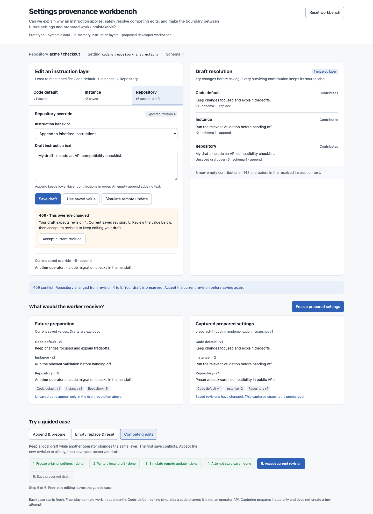
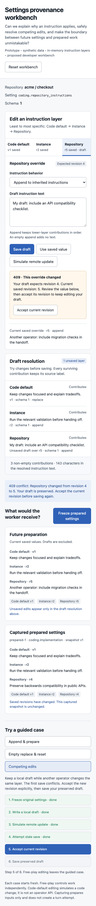

# Settings provenance workbench

A throwaway developer UX experiment for explaining instruction inheritance and prepared settings. Open [index.html](index.html) directly in a browser. No installation, server, credentials, or application data is needed. All changes are synthetic and stay in memory until the page reloads.

**Design question:** Can an operator understand why instructions apply, recover from concurrent edits without losing a draft, and distinguish future settings from immutable prepared inputs in one workbench?

The workbench keeps three views visible: the proposed draft resolution, currently saved settings for future preparation, and one captured prepared snapshot. Source labels show which instruction blocks survive; replaced blocks remain visible with an explanation. Revisions belong to the simulation, and the editable code-default version is a fixture control, not a proposed writable API.

## Interactions

- Edit Code default, Instance and Repository text. Drafts survive layer switches.
- Append instructions, replace them (including an empty string), or reset an override to inheritance.
- Save each layer separately. Discard a draft with **Use saved value**.
- Simulate another operator saving the selected override. A stale save produces a simulated 409 and retains the draft. **Accept current revision** updates the draft's revision only; another explicit save is required.
- Freeze current saved settings into a prepared snapshot. Unsaved drafts are excluded. Later saves and resets change future preparation while the snapshot remains unchanged.
- Reset all fixture state, or start one of three guided cases with real action buttons.

## Walkthroughs

1. **Append & prepare:** append a repository instruction, save, freeze, then apply a new code fixture. Future preparation shows code version 2; the captured input still shows version 1.
2. **Empty replace & reset:** save an empty repository replacement and freeze it. Then reset the override. Future preparation regains the Code default and Instance blocks; the captured instruction remains empty. The reset retains repository revision 6.
3. **Competing edits:** freeze revision 4, draft local instructions, simulate a remote save at revision 5, then attempt to save. The local draft survives the conflict. Accept revision 5 and save explicitly; future preparation uses revision 6 while the captured snapshot stays at revision 4.

Free-play actions exit guided progress without resetting the current state. Starting a guided case resets all state. Freezing again creates a new prepared ID and replaces the displayed snapshot; this prototype shows the latest capture only.

## Integration seams

The experiment follows [docs/scoped-settings.md](../../../docs/scoped-settings.md). It changes no application contracts or packages.

- `extensions/coding/src/settings.ts`: the actual `coding.repository_instructions` declaration and `coding.implementation` execution purpose. The real code default is empty; this fixture supplies explanatory synthetic text.
- `packages/server/src/scoped-settings-service.ts`: instruction resolution, ordered scopes, validation, source metadata, preview and snapshot construction. A production view should use this resolver rather than duplicate it in the browser.
- `packages/server/src/db/scoped-settings-repo.ts`: revision-checked writes and retained reset revisions.
- `packages/server/src/routes/settings.ts`: preview, override and per-process future/captured endpoints.
- `packages/domain/src/scoped-settings.ts`: `SettingsSource`, `ResolvedSetting` and `ScopedSettingsSnapshot` contracts.
- `packages/ui/src/components/SettingsField.svelte`: existing draft editing, preview and explicit conflict-revision acceptance.
- `packages/ui/src/lib/settings.ts`: preview/write client and per-process future/captured inspection.
- `packages/ui/src/pages/SettingsPage.svelte`: scope selection and settings grouping.

The inline `fixture`, `resolve`, `proposed` and `transition` functions form a pure simulation model. The DOM shell dispatches actions and renders their results. Preparation captures inputs only; it does not create a `ProcessTurnRecord` or increment an attempt.

## Validation

Performed in Chromium through an isolated agent-browser session:

- Completed all three guided cases using their visible controls and inspected resulting state.
- Confirmed append order and snapshot immutability after a code-default update.
- Confirmed empty replacement resolves to an empty string; reset restores two inherited blocks and retains revision 6.
- Confirmed the stale write returns a simulated conflict, preserves draft text, and leaves the expected revision at 4 while saved revision is 5.
- Confirmed accepting revision 5 does not save the draft; explicit resubmission advances to 6 and preserves captured revision 4.
- Edited and saved Instance text through free play; revision advanced to 3.
- Confirmed keyboard activation of the Instance layer preserves focus on that control.
- Captured and opened desktop (1440px) and mobile (390px) screenshots of the conflict state. Mobile document width matched its 390px viewport; no horizontal overflow was present. The browser reported no page errors.
- Extracted the inline script and ran `node --check`; ran `git diff --check` and targeted `biome check` on the HTML artifact.

The design detector ran with a degraded regex fallback because its HTML parser dependencies were unavailable. It flagged the selected layer's 3px bottom border; that control has square corners and deliberately uses a tab-selection underline. Screenshots were inspected directly. Application `test:full` was not run: this standalone helper changes no application, dependency or build/test/runtime path.

## Limits and provisional learning

This is a single-repository instruction experiment. It has no network, database, auth, credentials, repository discovery/merging, model selection, schema mismatch handling or worker. Captured records carry only the fields needed to explore this question and are not production wire payloads. The simulated remote update uses a fixed instruction string. Mobile favors a readable vertical sequence over simultaneous comparison.

The cases demonstrate why draft resolution and saved future resolution need different labels: a conflict can produce three legitimate instruction sets at once. Explicit revision acceptance makes that distinction actionable without discarding the local text. Empty replacement also needs its own visible outcome; a blank textbox alone cannot explain whether inheritance was cleared or restored. These are provisional design findings, not a decision to integrate the workbench.

Mobile conflict state

