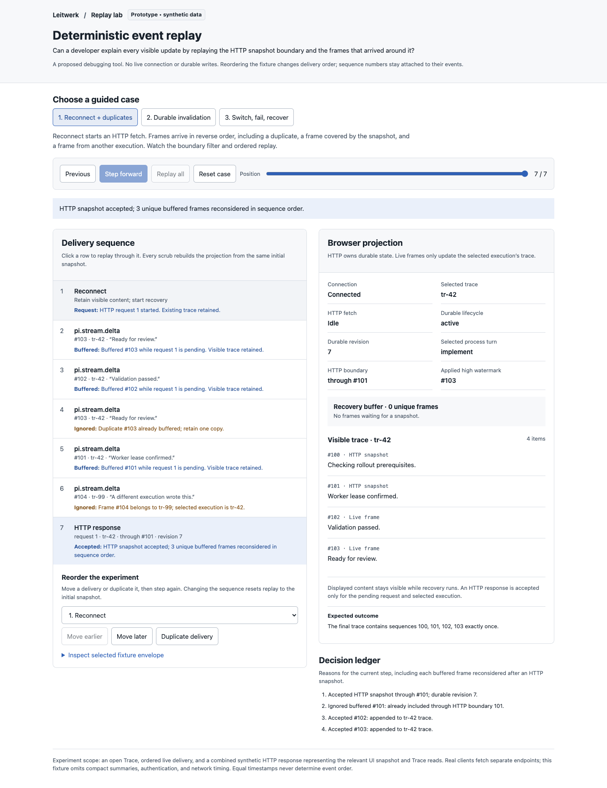
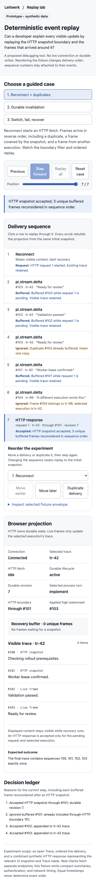

# Deterministic event replay

A standalone developer debugger experiment for browser WebSocket reconciliation.

**Design question:** Can a developer explain every visible update by replaying the authoritative HTTP boundary and the frames delivered around it?

Open `index.html` directly in a browser. The file has no dependencies, network calls, credentials, or persistent state. Reset restores the selected fixture.

## Interactions

Step forward or backward, scrub the replay slider, click a delivery to replay through it, or replay the whole case. Every position is rebuilt by a pure fold over the same initial snapshot. The browser projection exposes durable lifecycle and revision, selected execution, visible execution, pending request, snapshot boundary, live high watermark, buffered frames, and trace items. Every decision has a readable reason.

The delivery editor moves any fixture event earlier or later and duplicates events. Edits reset the replay position. HTTP request identities, execution identities, and event sequence numbers stay attached to the moved event, making invalid dependencies visible. Inspect the selected fixture envelope to see those fields.

Three guided cases are included:

1. **Reconnect + duplicates:** an HTTP request starts, frames 103 and 102 arrive in reverse order, 103 arrives again, a frame already covered by the eventual snapshot arrives, and another execution sends a frame. The snapshot through 101 replaces the base; buffered 102 and 103 replay once in order.
2. **Durable invalidation:** `process.updated` starts a fetch while durable lifecycle remains active at revision 7. Only the accepted HTTP response changes it to completed at revision 8. A duplicate frame is ignored.
3. **Switch, fail, recover:** select another execution during a fetch. Reject the old response and old-turn frames, retain the labeled old trace after failure, and retry. Only the matching successful response replaces the retained content.

## Integration seams

This is a debugging-tool proposal. It does not replace or import application code.

- `docs/websocket.md`: authoritative HTTP reads, `eventSequence` / `throughEventSequence`, reconnect buffering, turn correlation, and durable invalidation contracts.
- `packages/ui/src/lib/reasoning-history.ts`: the current expanded-history recovery buffer, sequence boundary, response acceptance, and trace projection.
- `packages/ui/src/lib/reasoning-history.test.ts`: existing checks for out-of-order buffered frames, duplicate suppression, recovery failure, and retained trace evidence.
- `packages/ui/src/lib/ws.svelte.ts`: reconnect and heartbeat recovery triggers.
- `packages/ui/src/pages/process-detail/inspector/inspection-data.svelte.ts`: independent inspector section loading and selected execution state.
- `packages/protocol/src/live-turn-projection.ts`: current production trace projection.
- `packages/server/src/process-ui-snapshot-presenter.ts`: authoritative browser snapshot presentation.
- `packages/server/src/process-inspection-reader.ts` and `packages/server/src/process-inspection-trace.ts`: recorded inspection reads and trace reconstruction.

A production debugger could record sanitized delivery envelopes and request boundaries around these seams, then feed them to the actual production projection. This prototype uses its own small pure model to explore the debugging workflow.

## Validation

Validated with real clicks in `agent-browser --session idea-06`:

- Stepped the reconnect case: the buffer contained exactly two unique frames after the duplicate 103, in arrival order 103 → 102.
- Accepted the HTTP snapshot through 101. The ledger ignored buffered 101 and accepted 102 then 103; visible sequences were `[100, 101, 102, 103]`.
- Stepping back and forward restored identical visible trace text.
- Durable invalidation left lifecycle active at revision 7 while a request was pending; accepted HTTP changed it to completed at revision 8.
- Stale response request 1 / tr-42 was refused after selecting tr-99. Failure retained visibly labeled tr-42 content. Retry accepted tr-99 items 203 and 204.
- Added a duplicate delivery through the editor: eight deliveries still produced `[100, 101, 102, 103]` once each.
- Moved the HTTP response before reconnect: it was rejected for lacking a matching pending request, and later frames stayed buffered.
- Desktop 1440 × 1100 and mobile 390 × 844 screenshots were opened and visually inspected. Mobile document width was 390px with no horizontal overflow. Browser errors were empty.
- Extracted inline JavaScript passed `node --check`. `git diff --check` passed.

Mobile

## Limits and provisional learning

All envelopes and identifiers are synthetic. This experiment represents an open Trace and combines the relevant UI snapshot and Trace responses into one fixture envelope; production clients fetch distinct endpoints. It excludes compact summaries, authentication, actual connection scheduling, committed-trace handling, and log import/export. It buffers incoming detail until recovery completes; the current production history can also show provisional live updates while its recovery fetch is pending. No application validation suite was run for this standalone helper.

Ordered live delivery is assumed outside recovery. An event at or below the applied high watermark is ignored; the prototype does not invent missing history from timestamps. Recovery needs an authoritative snapshot. Reordering exposes this dependency rather than promising arbitrary delivery order works everywhere.

The experiment supports showing two boundaries separately: the HTTP snapshot’s captured sequence and the highest subsequently applied sequence. A visible decision ledger makes duplicate suppression, wrong-turn rejection, and durable refetch behavior explainable. A useful next experiment would replay sanitized production captures through the production projection instead of the fixture model.

The standalone HTML also passes the repository Biome check.
