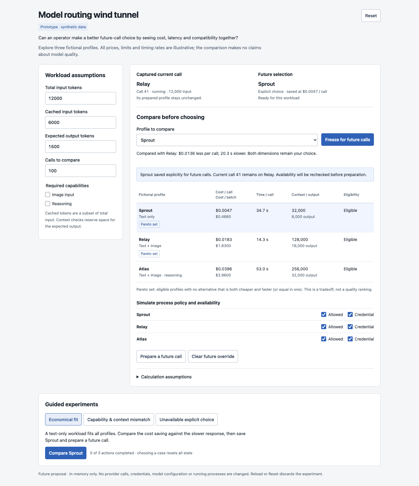
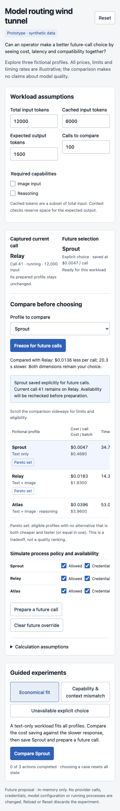

# Model routing wind tunnel

A throwaway, standalone experiment for comparing a manually chosen future-call
profile against cost, latency, context, capability and availability constraints.

**Design question:** can an operator make a better future-call choice by seeing
cost, latency and compatibility together, without mistaking a recommendation for
an explicit saved selection?

Open `index.html` directly in a modern browser. No server, install, credentials or
network access is required. All state is in memory; **Reset** or reload discards it.
The three profile names, prices, capabilities and timing rates are fictional.

## Try it

- Change total input, cached input, expected output and batch size. Estimates
  recalculate when you leave the field. Require image input or reasoning to narrow
  eligibility. Cached input cannot exceed total input.
- Compare any profile using the selector. The table marks the cost/time Pareto set
  among eligible profiles; neither the set nor browsing changes the future choice.
- **Freeze for future calls** saves an explicit profile only if it is eligible.
  **Prepare a future call** rechecks current availability and captures the selected
  profile and workload. Later edits leave captured records unchanged.
- Toggle the process allowlist or credential availability. A saved explicit choice
  stays selected even when unavailable; preparation blocks. **Clear future
  override** restores the fixture's inherited Relay selection and rechecks it.

Each guided experiment resets to a known state and provides ordered action buttons:

1. **Economical fit:** compare Sprout, freeze it, then prepare. At the default
   workload, Sprout costs $0.00468 per call versus Relay's $0.0183, while its
   simulated latency is about 20.3 seconds longer. Both belong to the Pareto set.
2. **Capability & context mismatch:** try Sprout with 120,000 input and 6,000
   output tokens plus image input and reasoning. The save blocks for context and
   both capabilities. Compare and freeze Atlas to recover.
3. **Unavailable explicit choice:** attempt Relay with a missing credential, then
   the retired profile missing from the catalog. Both saves block without choosing
   an alternative. Restore Relay's credential, compare it deliberately and save.

## Model and proposed integration seams

`inputErrors`, `estimate`, `compare`, `reduce` and `startCase` form the pure model
inside the inline script. The DOM shell renders model output and dispatches actions.

| Existing source | Potential integration |
| --- | --- |
| `docs/models.md` | Selection precedence, unavailable-profile blocking, captured starts and future-only edits are the governing contract. |
| `packages/server/src/process-model-selection.ts` | Profile options, policy evaluation, availability snapshots and preview of the next turn model. |
| `packages/server/src/routes/process-model-config.ts` | Existing preview and sparse patch endpoints for editing model settings. |
| `packages/server/src/process-engine/ops/update-model-config.ts` | Coordinated durable updates and the model-configuration event; this prototype performs neither. |
| `packages/ui/src/components/launcher-model-config.ts` | Existing launcher model configuration seam for a future comparison affordance. |
| `extensions/models/README.md` | Provider-owned cost, context, output, input-capability and reasoning metadata. Latency assumptions would need a separate evidence source. |

Production work would consume server-projected availability and policy, preserve
selection provenance, and submit edits through the existing server mutation.
Capability and forecast checks here are proposed experiment rules, not a claim
that production currently enforces every displayed workload constraint.

## Validation

- Extracted the inline script and ran `node --check`: passed.
- Targeted repository Biome check: passed, including HTML button semantics.
- `git diff --check`: passed.
- Real Chromium session `idea-08`: completed all three guided experiments.
- Confirmed a prepared Sprout record survives credential removal; the subsequent
  preparation blocks with no replacement. Current call 41 remains on Relay.
- Confirmed missing-profile and missing-credential saves block; deliberate
  credential restoration permits Relay to save.
- Set cached tokens above total input: every estimate became unavailable and
  every profile displayed the validation block.
- Captured and opened both screenshots at 1440px desktop and 390px mobile.
  Mobile document width was 390px; the comparison table scrolls within its region.
- The optional design detector ran in degraded regex mode because its parser
  dependencies were unavailable. Its font warning was resolved by inheriting the
  product's Public Sans/system fallback stack; screenshots were inspected directly.

Application code, dependencies and runtime configuration are unchanged. This
standalone helper uses scoped validation under `AGENTS.md`; `test:full` was not run.

## Limits and provisional learning

This is an operator decision aid, not automatic routing. It does not measure model
quality, actual bills, network delay, cache hit rates, hidden reasoning tokens,
concurrent throughput or real provider availability. Cache reduces simulated cost
but not latency. The inherited fixture is always Relay; the complete production
precedence chain, scheduled actions, retry semantics and worker recovery are outside
this experiment. Preparing a simulated call is not worker start acceptance and
creates no durable attempt.

The provisional learning is that eligibility should precede economic comparison,
and that the currently compared, explicitly saved and already captured profiles
need separate labels. A low price can be useful even when its slower latency is a
tradeoff; a capability mismatch is a block rather than a worse score. The UI still
needs operator evaluation before promoting this proposal.

Screenshots are direct captures of this local synthetic prototype:

Mobile comparison

