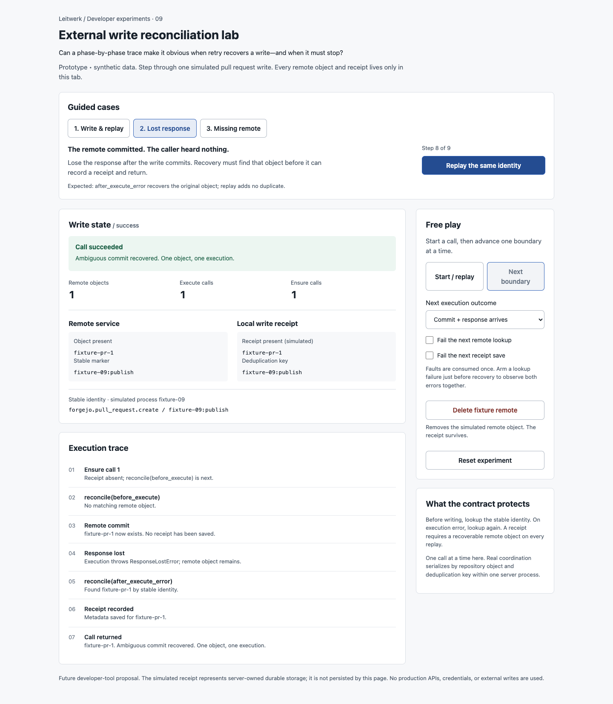
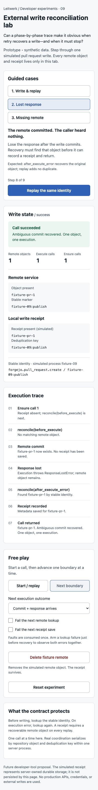

# External write reconciliation lab

Throwaway developer UX prototype. Open `index.html` directly in a browser; it needs no server or install. All objects, faults, and simulated receipts live in memory. Reloading discards them.

## Question

Can an interactive trace make it obvious when a retry recovers a committed external write, and when it must stop? A missing response can mean the provider committed the change. A local receipt also does not prove that the remote object still exists. This lab exposes those boundaries separately so extension authors can reason about reconciliation before implementing it.

## Try it

Choose a guided case, then press its next-step button. Each case resets the fixture and performs real reducer actions:

1. **Write & replay:** lookup, execute, receive the response, save the receipt, then replay. The second call returns the existing object. Expected: one remote object, one execution, two ensure calls.
2. **Lost response:** commit the remote object, lose the response, then recover through `after_execute_error`. Saving the recovered receipt completes the call; replay makes no duplicate.
3. **Missing remote:** finish a write, delete the fixture remote, then replay. `already_recorded` finds nothing and returns `ExternalWriteMissingRemoteError`; the receipt survives and execution remains at one.

Free play exposes Start / replay and Next boundary independently. Select a response loss or rejection before the next execution. Arm lookup failure immediately before recovery to observe an `AggregateError`. Receipt-save failure leaves committed remote work recoverable by the next call. Faults apply once; the controls show whether a fault is still armed. Reset returns to an empty fixture.

The state panel shows call outcome, current boundary, remote count, execution count, ensure count, object identity, and receipt metadata. The trace retains each crossed boundary. The pure `reduce(state, action)` function is separate from the DOM shell.

## Existing contract and possible integration

- `packages/external-writes/src/external-writes.ts`: `bindExternalWrites().ensure`, `recordWriteIfMissing`, and `ExternalWriteMissingRemoteError` define the simulated order. The experiment includes all three reconcile phases, receipt-before-return behavior, execution-error recovery, and combined execution/recovery errors.
- `packages/external-writes/src/contracts.ts`: `WriteOperation`, `WriteIdentity`, and the public `ExternalWrites` interface define the operation boundary.
- `packages/server/src/db/external-write-log-repo.ts`: server-owned receipt storage is represented by the in-memory receipt panel.
- `docs/process-sdk.md`, “Typed external writes”: expected lookup, replay, and error behavior. The runnable experiment could become a companion exercise for extension authors.

A production inspector would need explicit observation hooks around these boundaries. This branch adds no hooks or application integration and proposes no change to write semantics.

## Validation

Performed with an isolated Chromium session (`idea-09`) against the local file:

- Completed all three guided cases and checked rendered counts, receipts, outcomes, and traces.
- Observed lost-response recovery and replay retain one remote object and one execution.
- Observed a deleted logged remote fail with `ExternalWriteMissingRemoteError`, zero remote objects, and one execution.
- Injected a failed recovery lookup; observed `AggregateError` with both execution and lookup errors.
- Then failed receipt storage on replay; a later replay succeeded with one remote object and one execution across three calls.
- Failed preflight lookup; execution count stayed zero. Rejection before commit followed by an empty recovery rethrew the original `NetworkError`.
- Replayed the guided case at 390 × 844; counts and outcome remained correct. No browser errors or horizontal page overflow were observed.
- Captured and visually inspected full-page desktop (1440-pixel viewport) and mobile (390-pixel viewport) screenshots.
- Targeted Biome check, inline JavaScript `node --check`, and `git diff --check` passed.

This is an isolated helper. Application packages, dependencies, and build configuration are unchanged; full application validation was not run under the scoped-validation policy.

## Provisional learning and limits

Separating remote commit from response delivery makes the ambiguous-success case concrete. Showing the receipt beside the remote object explains why a logged write with a missing remote is a recovery error, not permission to recreate it. The trace can explain the contract; it does not establish that production providers reconcile correctly.

The simulation handles one stable identity and one call at a time. It does not model queues, concurrent servers, closed-object lookup, remote updates, metadata-extraction failure, receipt insert races, or real storage durability. Errors are state values with readable messages rather than actual thrown JavaScript exceptions. Fixture deletion is an experiment control. No external operation occurs.

Mobile recovery state

