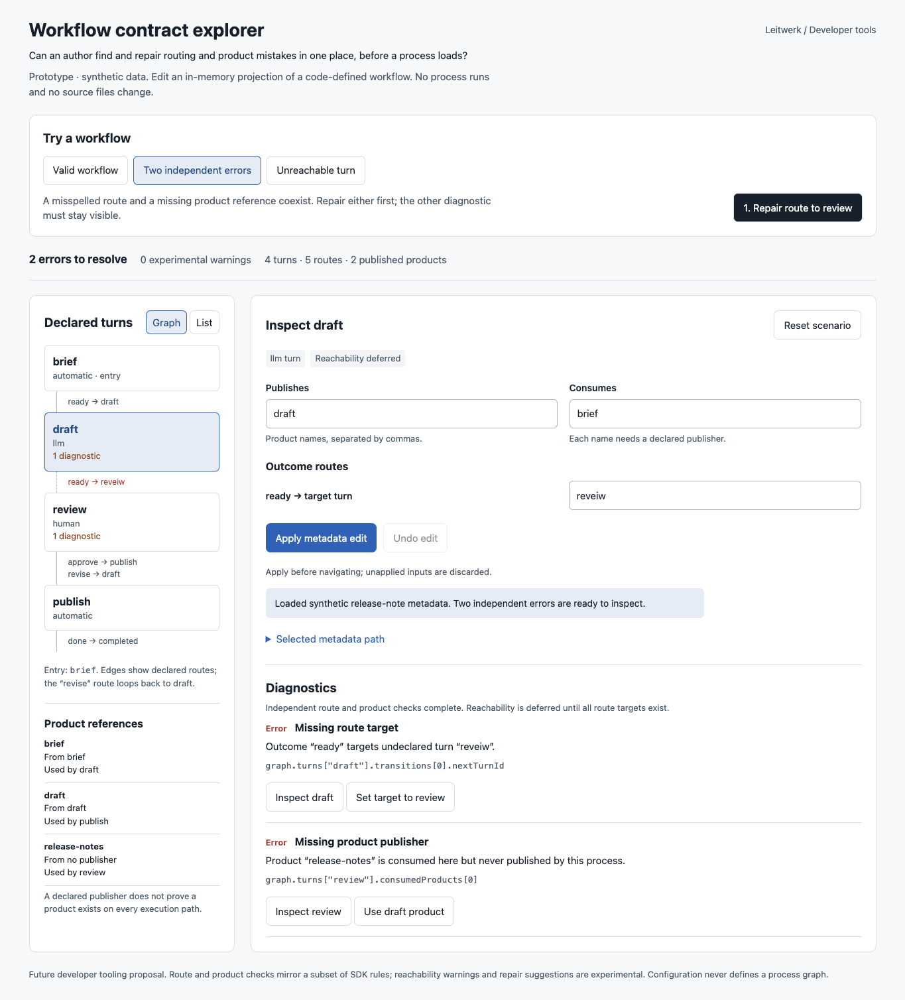
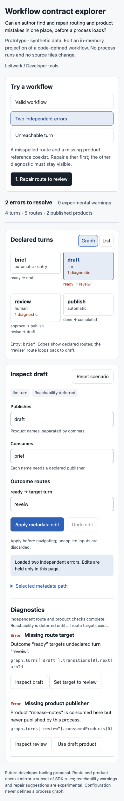

# Workflow contract explorer

Can a process author find and repair routing and product mistakes in one place,
before a process loads?

This throwaway developer UX experiment puts a selectable adjacency graph, editable
metadata projection, diagnostic paths, and explicit repairs on one screen. It uses
synthetic release-note workflow data. Open `index.html` directly in a browser;
there are no dependencies, server, build step, network requests, or saved state.

## Interactions

Select turns in Graph or List mode. Edit route targets and comma-separated product
publisher/consumer references, then apply the metadata edit. Counts, diagnostics,
reachability, product references, and the selected metadata snippet update from
the current graph. Undo restores the previous applied graph. Reset restores the
selected scenario. Apply before navigating: unapplied inputs are discarded.

Three guided scenarios provide real actions:

- **Valid workflow:** inspect review, then draft. The `revise` cycle is legal and
  the reachability traversal terminates without treating the loop as an error.
- **Two independent errors:** repair `draft → reveiw` to `review`; the unrelated
  missing `release-notes` publisher remains. Change that consumer to `draft` to
  clear the second error. Either repair can be performed first.
- **Unreachable turn:** inspect archive, then route review approval through it.
  Archive already routes to publish, so this connects the orphan to the workflow.

Free play accepts arbitrary route targets and product names. Unknown targets,
invalid product names, and missing publishers accumulate as independent errors.
Reachability is deferred while any route target is invalid, avoiding derived
warnings caused by an already broken route. Arbitrary valid cycles are traversed
with a visited set. Repair suggestions are intentionally specific to the fixtures.

## Integration seams

These are existing repository seams, not imports used by this standalone demo:

- `packages/process-sdk/src/define-process.ts`: `validateProcessDefinition` and
  `compileProcessDefinition` collect contextual independent errors, recompile
  metadata and validate retained transitions without executing author callbacks.
- `packages/process-sdk/src/process-graph.ts`: `ProcessGraphView`,
  `validateProcessGraphProducts`, and `validateProcessGraphTurnTransitions` supply
  the projected metadata and contract checks an integrated inspector could use.
- `packages/process-sdk/src/process-definition-validation.test.ts`: independent
  routing/product diagnostics and suppression of dependent connectivity errors.
- `packages/domain/src/semantic-entry-refs.ts`: the product-name rule
  `^[a-z][a-z0-9-]*$` mirrored by this experiment.
- `docs/process-sdk.md`, “Turn types”: definition-time validation and the boundary
  between a code-defined graph and configuration-supplied runtime defaults.
- `packages/ui/PRODUCT.md` and `packages/ui/DESIGN.md`: visual and accessibility
  context for the proposed developer surface.

The pure `Workflow` block owns fixtures, graph analysis, edits, and repairs. The
separate imperative shell renders and dispatches UI actions. Metadata paths are
source-like paths into the synthetic projection, not real source maps or editable
TypeScript source locations.

## Validation performed

- Targeted `biome check --write tools/prototypes/10-workflow-linter/index.html`
  passed without remaining diagnostics.
- Extracted inline JavaScript passed `node --check`; `git diff --check` passed.
- Real Chromium interaction checks in isolated `agent-browser` session `idea-10`:
  route repair reduced two errors to one, product repair cleared the second, undo
  restored it, and the archive route repair cleared the reachability warning.
- Free-form edits to review added an unknown target and unpublished consumer;
  both errors appeared together. Adding `Bad_Name` as a publisher produced its
  own invalid-name diagnostic. List selection and reset were exercised.
- Desktop 1365 × 1000 and mobile 390 × 844 screenshots were captured and opened
  for visual inspection. The mobile document width was 390px; no horizontal
  overflow was observed. The browser reported no runtime errors.
- The Impeccable detector ran in degraded regex mode because its parser modules
  are unavailable. It reported no findings; computed contrast was not audited by
  that tool. Visual inspection remains the evidence for layout.

This changes only standalone prototype artifacts. The application and its runtime
are untouched; `npm run test:full` was not run, per AGENTS.md scoped validation.

## Provisional learning and limits

Aggregating independent errors makes partial repairs observable. Deferring
reachability until routes are structurally sound keeps derived warnings from
swamping the two actionable causes. Explicit repair buttons also make it possible
to compare an intended fix with its resulting graph immediately. These are
interaction observations, not user-research results.

The SDK already validates many contracts that this experiment omits, including
entry declarations, alternate entries, happy-path connectivity, shared forms,
optional product consumers, mapped turns, and completion metadata. The
unreachable-turn warning is a **future advisory proposal**, not an assertion that
the SDK currently rejects every unreachable turn. This fixture has one entry.
A declared product publisher does not prove runtime publication or availability
on every route. The graph view is a compact adjacency diagram, not an automatic
layout engine. The mobile view exposes products through individual turn selection
and omits the desktop-wide product-reference index. The prototype never executes
callbacks, loads an extension, modifies source, or enables configuration-defined
processes. No production implementation decision is made by this draft.

