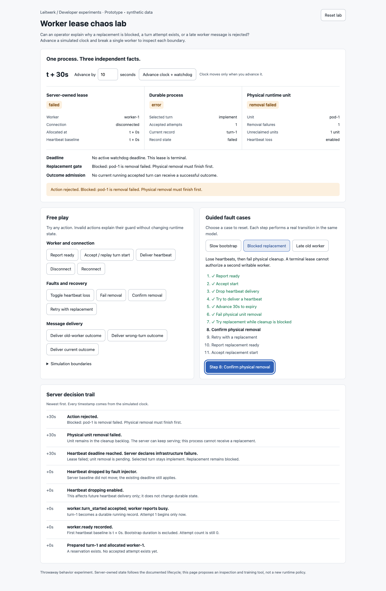
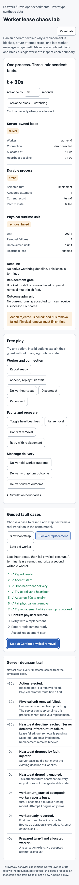

# Worker lease chaos lab

A throwaway developer tool for exploring worker failure and recovery. Open
`index.html` directly in a browser; no install, server, or network is required.
All data is synthetic and stays in memory. Reset lab restores the initial fixture.

## Design question

Can an operator explain why a replacement is blocked, a turn attempt exists, or
an old worker message is rejected by inspecting the state and its decision trail?

The experiment separates the server-owned lease, durable process state, and
physical runtime unit. A pure `transition(state, action)` reducer drives both
free-play controls and guided cases. The browser shell only dispatches actions
and renders the returned state.

## Explore

- **Slow bootstrap:** advance 90 seconds before readiness. The heartbeat baseline
  remains unset despite the 30-second heartbeat timeout. Readiness establishes
  the baseline; acceptance creates attempt 1. Replaying acceptance leaves it at 1.
- **Blocked replacement:** accept a start, drop heartbeats, and advance to timeout.
  Fail unit removal and try replacement. The failed lease and process error do not
  remove the old unit. Confirm removal, retry, and accept the replacement start.
- **Late old worker:** replace a failed worker, then deliver its old outcome and an
  outcome for the wrong turn. Both leave the replacement's running record intact.
  A current correlated outcome completes the fixture's only turn.

Free play includes readiness, acceptance replay, heartbeat delivery/loss,
disconnect/reconnect, clock advance, cleanup failure/success, replacement retry,
and current/stale outcomes. Invalid actions explain their guards. Free play
interrupts the ordered walkthrough; restart its selected case to resume.

## Repository seams

A future integrated diagnostic tool would read these existing boundaries. The
prototype does not import them or invoke runtime commands.

| Source | Boundary represented |
| --- | --- |
| `docs/server-worker-lifecycle.md` | Server ownership, readiness baseline, accepted attempts, physical replacement handoff |
| `packages/server/src/supervisor/worker-supervisor.ts` | Startup deadline, current worker handle, `spawnWorkerNow()` reclamation gate |
| `packages/server/src/supervisor/stale-heartbeat-watchdog.ts` | Eligible lease states and stale heartbeat comparison |
| `packages/server/src/supervisor/worker-unit-reclaimer.ts` | Pending unit cleanup, failure backlog, stop-before-replacement handoff |
| `packages/server/src/supervisor/ipc-handler.ts` | Readiness and heartbeat receipts, accepted start and terminal message routing |
| `packages/server/src/supervisor/worker-lease-observer.ts` | Lease identity admission |
| `packages/server/src/supervisor/worker-turn-ipc-recorder.ts` | Correlated terminal record handling |
| `packages/server/src/process-engine/ops/accept-worker-turn-start.ts` | Durable acceptance and attempt creation |

## Validation

Validated with the real browser at desktop 1440 × 1100 and mobile 390 × 844:

- Completed all three guided cases with keyboard activation.
- Observed bootstrap survive 90 seconds, readiness establish its first baseline,
  and duplicate acceptance retain exactly one attempt.
- Observed heartbeat timeout park the process at selected turn `implement`;
  replacement was rejected after removal failure, then allowed after removal.
- Observed retry reserve `turn-2` while attempts remained 1, followed by acceptance
  increasing the count to 2.
- Observed old-worker and wrong-turn outcomes preserve the running replacement;
  the current correlated outcome completed the fixture.
- Exercised startup expiry at 120 seconds: zero accepted attempts remained.
- Exercised disconnect/reconnect at 10 seconds: the heartbeat deadline stayed at
  30 seconds until heartbeat delivery moved it to 40 seconds.
- Reset via pointer activation after scrolling into view. Off-screen pointer
  clicks in the installed automation CLI did not scroll/activate; keyboard
  navigation worked. `agent-browser doctor --offline --quick` reported no failures.
- No browser runtime errors. Mobile document and body widths were both 390px.
- Opened and inspected both actual screenshots; controls and state fit the layouts.
- Inline JavaScript passed `node --check`; the HTML passed repository Biome and
  `git diff --check`.

This isolated helper does not change application code, dependencies, or runtime
configuration. Full application validation was not run (AGENTS.md section 7).

## Limits and provisional learning

This is a deterministic training/inspection proposal, not a production simulator.
The 120-second startup and 30-second heartbeat limits are illustrative fixture
settings. Advancing time runs one watchdog observation; it does not model periodic
scheduling or automatically send heartbeats. Allocation starts at the already
bootstrapping phase. Start acceptance and the worker's busy report are combined
into one action. Accepted-but-idle reconciliation and terminal acknowledgement
replay are outside this experiment.

Physical cleanup callbacks are manual to expose the replacement gate; there is
no runner, backoff scheduler, network, SQLite, storage, credential, or live worker.
The prototype labels physical removal separately from terminal lease state. The
single synthetic turn completes its process on successful outcome. History is
in-memory and unbounded until reset.

The provisional result is that three separate state columns plus an explicit
replacement reason make the dangerous interval visible: **a failed lease can
still own a physical unit awaiting removal**. The accepted-attempt counter also
makes bootstrap and retry reservations distinguishable from actual execution.
This warrants user feedback before adding a diagnostic UI to the application.

Mobile capture

