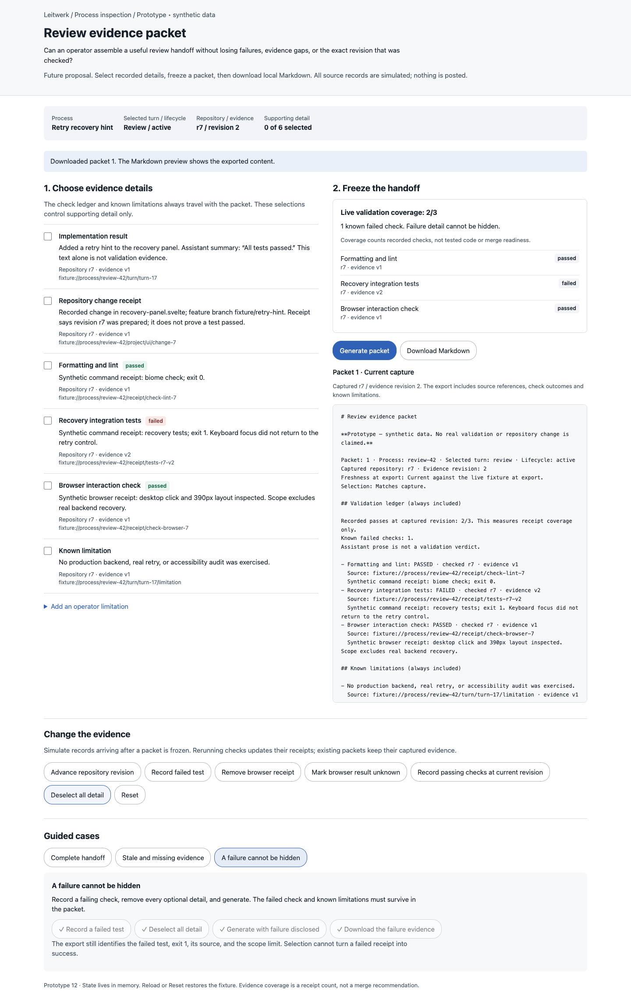
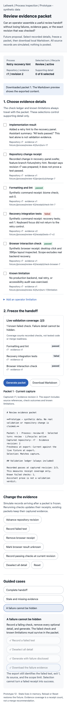

# Review evidence packet

A throwaway experiment for preparing a review handoff from process evidence.
Operators select supporting details and generate a local Markdown packet with
source references, recorded check outcomes, known limitations, and captured
repository/evidence revisions.

**Design question:** Can a useful handoff remain concise without allowing selection,
assistant prose, or an outdated repository revision to conceal weak evidence?

Everything is synthetic and held in memory. Open `index.html` directly in a browser;
there is no server, dependency install, application route, or external write.

## What to try

- **Complete handoff:** use the guided buttons to freeze the r7 fixture and download
  Markdown. The packet contains three passing receipts, selected turn output and
  repository receipt details, source references, and a known limitation.
- **Stale and missing evidence:** freeze r7, advance to r8, remove the browser
  receipt, and regenerate. The old packet stays captured at r7 and displays a stale
  export warning. The new packet has zero current passes: two old receipts and one
  missing receipt. A current capture does not mean current checks passed.
- **A failure cannot be hidden:** record a failed test, deselect every detail, then
  generate and download. The mandatory ledger still contains `FAILED`, exit 1, its
  receipt source, and the known scope limitation.

Free play also supports unknown browser outcomes, simulated passing receipts at the
current revision, custom operator limitations, individual detail selections, and
reset. Selection changes after capture are labelled separately from source changes.
Export keeps the capture immutable while adding the freshness observed at download.
The exact exported Markdown is shown in the preview.

## Model and integration seams

`PacketModel` is a pure fixture reducer plus coverage and Markdown projections.
The DOM shell owns events and the Blob download. Check verdicts come only from
structured fixture receipts; the assistant's “All tests passed” sentence never
changes coverage. All check outcomes and known limitations are mandatory in exports.

Potential production integration points, not implemented here:

- `packages/domain/src/domain-model.ts`: `ProcessTurnRecord.turnResultMarkdown`,
  `resultPiEntryId`, and record IDs identify result evidence. `ProcessProject`
  supplies repository locators, branch/resource references, and pipeline status.
  None of those fields alone establishes revision-bound validation success.
- `packages/domain/src/execution-inspection.ts`: `InspectionEvidence<T>` preserves
  recorded, not-recorded, unavailable, redacted, and not-applicable evidence states.
- `packages/server/src/process-inspection.ts`: `createInspectionLineage` establishes
  source ownership from recorded receipts and boundaries, rather than proximity.
- `packages/server/src/process-inspection-reader.ts`: `ProcessInspectionReader`
  provides server-owned execution summary, context, trace, and captured configuration.
- `packages/protocol/src/execution-inspection.ts`: existing execution inspection
  response contracts are the read boundary for a future inspector export surface.
- `packages/server/src/process-ui-snapshot-presenter.ts`: run details aggregate
  recorded project facts for the process overview.
- `docs/ui.md`: the inspector distinguishes evidence states and forbids inferred
  validation verdicts from prose. `packages/ui/PRODUCT.md` and `DESIGN.md` guide the
  quiet operational presentation.

This prototype proposes a structured check receipt with revision and scope; it does
not imply that an existing inspector API already supplies that schema. A production
implementation would need server-owned, revision-correlated capture and an explicit
mapping for unavailable/redacted evidence. It must retain the current lifecycle and
turn record ownership rules. Local helper worktrees are unrelated to runtime process
workspaces, which remain full clones.

## Observed validation

- Biome `check --write` passed for `index.html`.
- Extracted inline JavaScript passed `node --check`; `git diff --check` passed.
- Chromium through the isolated `agent-browser --session idea-12` session exercised
  all three guided cases using actual UI controls and completed real local downloads.
- Downloaded Markdown files were read: the happy case had a 3/3 receipt ledger and
  manifest; the stale/missing case had a 0/3 ledger with `STALE` and `MISSING`.
- Browser inspection confirmed the frozen packet kept repository r7 / evidence
  revision 1 while live state advanced to r8 / revision 2. Export gained a stale warning.
- With zero selected details, the failed check, exit 1, its source, and the limitation
  remained in the export. Unknown browser output stayed distinct from missing and failed.
- The full failure walkthrough and download also worked at 390px width. Page width
  equalled viewport width with no horizontal overflow. No browser errors were reported.
- Desktop (1440px) and mobile (390px) screenshots were opened and visually inspected.

These are focused checks of a standalone helper. Application code, dependencies,
and build/runtime configuration are unchanged; `npm run test:full` was not run.

## Provisional learning and limits

A mandatory ledger lets detail selection remain useful without making it a filter
for inconvenient check outcomes. Freshness and validation coverage must be separate:
a fresh export can still contain old or missing validation evidence. Freeze the source
manifest, then attach freshness at export rather than silently updating old claims.

The fixture has one repository, one output, and one latest receipt per expected check.
It does not implement historical receipt retention, source authorization, redaction,
real content digests, atomic server capture, multi-repository scope, or durable packet
storage. Fixture references are explicit `fixture://` identifiers, not working live
inspector links. Exported freshness reflects only the instant of download and cannot
update after the file leaves the page. No review is posted and no merge verdict is given.

Mobile failure disclosure

