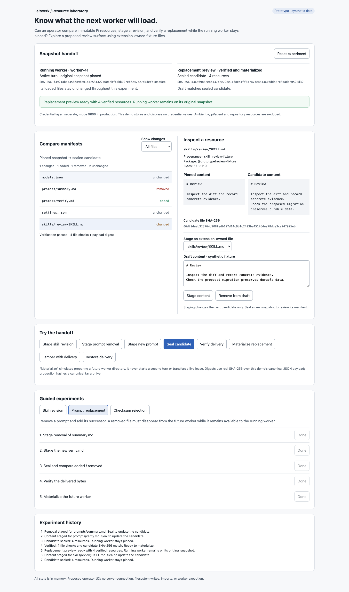
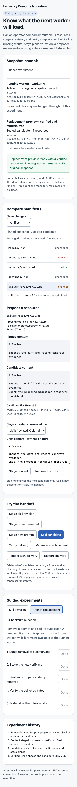

# Resource snapshot diff

Throwaway operator/developer UX experiment. Open `index.html` directly in a modern browser; no install or server is needed. All files and workers are synthetic, and state resets on reload.

## Question

Can an operator understand a Pi resource revision and verify a future worker's resources while a running worker stays pinned to its immutable snapshot?

The prototype compares two non-secret manifests with changed, added, removed, and unchanged filters. Select a resource to inspect its original and candidate content, owner, package, byte size, and SHA-256. Edit the curated extension fixture files, stage additions or removals, and seal a new candidate. Delivery verification checks each file and the entire candidate payload. Materialization repeats verification before creating an in-memory replacement preview.

Staging does not edit a sealed candidate. Sealing does not edit the running snapshot. Corrupting delivered bytes does not edit the sealed manifest. These boundaries are visible throughout the experiment.

## Walkthroughs

- **Skill revision:** stage a revised review skill, seal the candidate, verify delivery, and materialize a replacement. The running worker's original digest remains unchanged.
- **Prompt replacement:** remove `prompts/summary.md`, add `prompts/verify.md`, and seal. The manifest exposes one addition and one removal. The replacement contains only the new prompt; the running snapshot retains the original prompt.
- **Checksum rejection:** seal a revision and tamper with its delivery. Attempting materialization reports a file checksum/size mismatch and payload mismatch, with no replacement. Restore delivery, verify, and materialize successfully.

Selecting a walkthrough resets to its baseline. Free-play controls and the draft editor work independently. Reset restores the original fixtures. The initial view contains one sealed skill revision for immediate comparison.

## Integration seams

This isolated HTML does not import or modify application code. A production design would build on:

- `packages/worker-protocol/src/pi-resource-manifest.ts`: manifest schema and provenance fields, including owner, package, size, and SHA-256.
- `packages/worker-protocol/src/pi-resource-bundle.ts`: canonical archive construction and digest verification.
- `packages/server/src/pi-resources/assemble.ts`: immutable non-secret snapshot assembly from authorized extension resources.
- `packages/server/src/pi-resources/resource-collector.ts`: resource collection and source provenance.
- `packages/server/src/pi-resources/bundle-pin-lifecycle.ts`: retention of the live LLM start's pinned resource digest.
- `packages/worker/src/pi-resource-bundle.ts`: verified persistence and atomic materialization into the managed worker directory.
- `docs/process-workspace.md`: managed agent environment and snapshot retention contract.
- `packages/ui/PRODUCT.md` and `packages/ui/DESIGN.md`: operator audience and visual conventions.

## Validation

- Biome check on the standalone HTML passed.
- Extracted inline script passed `node --check`; `git diff --check` passed.
- Real Chrome browser at a `file://` URL verified and materialized the initial skill revision.
- The checksum walkthrough rejected tampered `models.json` bytes and the mismatched payload, leaving the replacement absent. Restoring the delivery then verified and materialized successfully.
- The prompt walkthrough produced one added file, one removed file, and three unchanged files. Inspected model state confirmed the original prompt remained pinned while only its replacement appeared in the future worker.
- All four change filters were exercised; the removed-resource inspector showed absent candidate content and no candidate digest.
- Desktop (1440 px) and mobile (390 px) screenshots were captured and visually reviewed. Mobile document width equaled viewport width, with no horizontal overflow.

Application validation was not run: this changes only a standalone throwaway helper and its documentation/screenshots, under `AGENTS.md` section 7.

## Provisional learning and limits

A useful review surface needs three distinct states: staged edits, a sealed candidate, and the bytes received by the future worker. Conflating candidate identity with delivered content would hide the checksum failure. Keeping the running digest beside the replacement preview makes the lack of live mutation inspectable.

Digests are real Web Crypto SHA-256. The fixture snapshot digest covers a deterministic JSON payload; production hashes canonical tar bytes. This is not a production archive validator, compatibility checker, secret scanner, or filesystem materializer. Only curated synthetic extension resources may be staged. No ambient Pi or repository resources are imported. Credential values never enter the model or UI; their separate production layer is described only as metadata.

The replacement is a future-worker preparation preview, not a second running worker or a live lease handoff. No process turn is started. The experiment does not propose changing the existing worker lifecycle or promoting repository resources into the MVP.

Mobile

