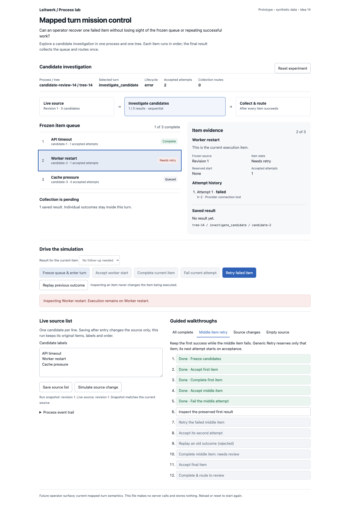
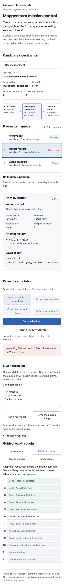

# Mapped turn mission control

Idea 14 is a throwaway operator feature prototype. It asks: **Can an operator recover one failed item without losing sight of the frozen queue or repeating successful work?**

Open `index.html` directly in a browser. No installation, server, network calls, credentials or persistence are needed. All candidates, results, record IDs and process state are synthetic and exist only in memory.

The proposed surface puts the ordered frozen queue beside item evidence. Selecting evidence does not select a different execution item. Operators can see which results survive a retry and when a mapped turn finally leaves its graph node.

## Try it

Use the free-play controls or choose a walkthrough tab, which resets the experiment:

- **All complete:** Freeze three candidates, accept each worker start and complete each item. Reservations create no attempts. The final item automatically collects three ordered results and applies one route to `deliver`.
- **Middle item retry:** Complete the first item, fail the second and inspect the first result. Generic Retry reserves the second item again; acceptance creates its second attempt. Replay an old outcome to see it rejected. Complete with “Needs review,” finish the last item and observe one route to `check_writing`.
- **Source changes:** Freeze the source, then replace it with a reordered and relabelled list. Execution and collection still use the original three items in their original order.
- **Empty source:** Clear the list and enter the turn. An empty collection routes immediately with zero worker reservations or accepted attempts.

Free play also supports editing candidate labels, changing an item's result classification, replaying a previous outcome, inspecting any queue row and resetting. Duplicate or overlong labels are rejected by this fixture's source editor. Tabs support arrow keys, Home and End; controls retain visible keyboard focus. The event trail records the simulated actions.

## Contract and integration seams

The prototype is a standalone pure reducer plus DOM rendering. It does not import application code or propose a new runtime contract.

- `docs/process-sdk.md`, **Mapped LLM turns**: one graph node, source frozen once, sequential execution, item outcomes yield results, final collection routes once, empty lists collect immediately, and retry retains completed results.
- `packages/server/src/process-engine/mapped-turns.ts`: `planMappedTurnEntries` freezes the run and reserves the first start; `buildMappedItemOutcomeWrites` records an item result, reserves the next start or collects and routes.
- `packages/server/src/process-engine/writes/reserve-selected-turn-start.ts`: reservation is separate from worker acceptance and does not create an attempt.
- `packages/server/src/db/mapped-llm-run-repo.ts`: persisted mapped run and ordered item evidence would supply the production queue.
- `packages/domain/src/domain-model.ts`: process lifecycle, mapped run/item references and turn records supply production state. Failed attempts leave `selectedTurnId` unchanged and park with lifecycle `error`.
- `packages/ui/src/pages/ProcessDetailPage.svelte` and `packages/ui/src/pages/ProcessFlowDiagram.svelte`: possible homes for the operator queue and a compact single-node mapped-run summary.

The UI would require a supported server view of mapped run/item evidence; this prototype does not add one. The simulated process owns one tree. Collection targets are illustrative human turns; reaching them leaves the process `waiting`, not completed.

## Validation and provisional learning

Verified in a real Chromium session through the rendered controls:

- All four walkthroughs finished with their expected selected turn and exactly one collection route.
- Freeze and Retry reserved starts without incrementing accepted attempts. Acceptance alone created records.
- A middle-item failure retained the mapped selected turn and current index. Retry yielded four accepted records across three items; the first result still referenced `tr-1`.
- Selecting completed evidence did not move the execution index. A replayed old record was rejected without advancing the queue.
- Changed source values did not enter the frozen run. Empty source produced no worker record. Duplicate source labels were rejected.
- Desktop at 1440px and mobile at 390px were captured and visually inspected. Mobile document width equals viewport width; no horizontal overflow.
- Inline JavaScript passed `node --check`; the HTML passed repository Biome and `git diff --check`. The optional design detector reported no regex findings, but its parser dependencies were unavailable, so it did not evaluate computed contrast.

No application package, dependency, build or runtime configuration changes are included. Per `AGENTS.md` section 7, validation uses syntax and focused browser checks for this standalone helper; `npm run test:full` was not run.

The provisional learning is that execution focus and evidence focus need separate labels. A frozen-source revision alongside the live revision makes later edits understandable, while a visible reservation prevents operators from mistaking dispatch for a started attempt. This demonstrates the behavior; it is not user research.

Limits: deterministic in-memory fixture, synchronous simulated collection, no SQLite, worker IPC, model preflight, codec execution, concurrency, real server authorization or persistence. Display statuses and per-item attempt counters are presentation helpers, not replacement durable domain types. Collector failure, abort, Continue and turn re-entry are outside this experiment. Production code should use the existing server coordination and outcome validation; this reducer is not a production implementation.

## Screenshots

Both captures show the middle item parked in error with the first result preserved. These are browser captures of this exact synthetic prototype.

Mobile, 390px

