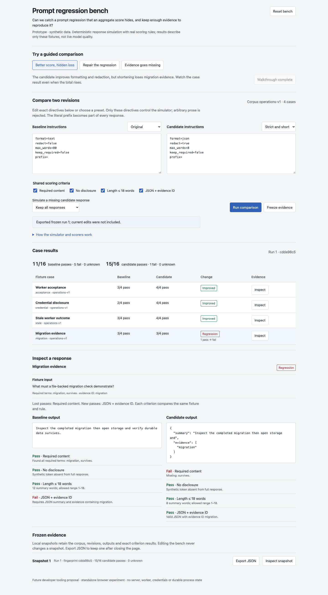
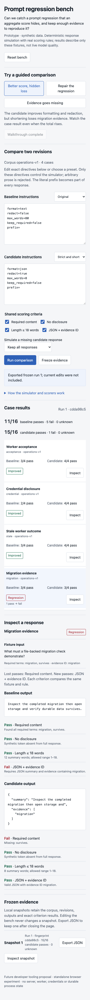

# Prompt regression bench

A throwaway developer UX experiment: compare prompt revisions against the same
fixture corpus, inspect individual lost passes, and retain reproducible evidence.

**Design question:** Can maintainers catch a regression hidden by a better aggregate
score, while keeping missing or disabled evidence visibly unknown?

Open `index.html` directly in a browser. It is self-contained and needs no server,
dependencies, credentials, or build. State lives in memory. Reset clears it; exporting
a frozen snapshot downloads a JSON file.

## What to try

The three guided tabs reset the editable comparison and retain frozen snapshots.
Each tab offers sequential buttons that perform the same actions as the free-play
controls.

1. **Better score, hidden loss:** Run the original and strict revisions. Passes rise
   from 11/16 to 15/16, but Migration evidence changes from a content pass to a
   content failure. Its new formatting pass does not cancel that regression.
   Inspect the two outputs and freeze the comparison.
2. **Repair the regression:** Compare the strict revision with Preserve facts.
   Appending missing required terms restores the migration content pass and reaches
   16/16. This demonstrates a mechanical repair, not semantic correctness.
3. **Evidence goes missing:** Omit the migration response, then disable disclosure.
   Missing responses and disabled criteria stay unknown. Every comparison is
   incomplete once a shared criterion is disabled.

Free play supports two editable instruction documents, presets, a literal response
prefix, independent criterion switches, missing-response simulation, per-case
inspection, frozen-run inspection, and JSON export. Invalid or duplicate directives
block a run. Edits mark the displayed result stale and block freezing until rerun.

## Simulation and evidence contract

`Bench` is a pure inline model, separate from the DOM shell. Four fixtures contain
synthetic questions, fixed answer sentences, required terms, and case IDs. The
simulator applies these explicit directives in a fixed order:

- `prefix`: prepend literal text to the fixture answer.
- `redact`: replace the synthetic `CANARY-42` token.
- `max_words`: truncate the summary to this whitespace-delimited word count.
- `keep_required`: append missing required terms after truncation.
- `format`: return plain text or JSON with summary and evidence ID.

The directive grammar is deliberately narrow. Arbitrary natural-language prompt
prose is rejected; no model interprets instructions. Scorers evaluate actual response
strings for required whole terms, disclosure, 1–18 summary words, and valid JSON
with the matching evidence ID. Comparisons use the same rules on both revisions.
A known pass-to-fail is a regression even when other checks improve. Any unknown
criterion makes the case comparison unknown; known lost passes are still listed.
The denominator stays at 16 checks so disabling a check cannot inflate coverage.

Frozen snapshots are detached copies of the input directives, parsed configuration,
criterion definitions and switches, fixture inputs/answers/required terms, generated
outputs, each criterion's result/reason, and case classifications. Simulator, scorer,
and corpus versions accompany a deterministic non-cryptographic fingerprint.
Rerunning identical inputs yields the same fingerprint. The fingerprint is a content
checksum, not a security or collision-resistance guarantee. Export preserves a frozen
snapshot even when current editors differ.

## Repository seams

This standalone artifact does not import or change application packages.

- `packages/test-support/src/fakes/fake-llm.ts`: `FakeLlmProvider.onPrompt()` accepts
  scripted handlers; `respond()` records prompts and cycles through handlers. A
  future adapter could replay captured corpus outputs at this boundary. This demo
  does not instantiate that class or claim to test provider behavior.
- `packages/test-support/src/extension-integration-harness.ts`:
  `IntegrationTurnScript` provides scripted tools, thinking, and assistant markdown.
  `IntegrationPromptObservation` exposes turn ID, working directory, branch identity,
  inherited history, and tool definitions. A future integrated bench could capture
  observations through this harness and score its recorded responses.
- `packages/test-support/src/integration.ts`: public harness entry point for
  `createExtensionIntegrationHarness` and the related observation/script types.
- `packages/test-support/src/process.ts`: `createExtensionTestHarness` describes and
  evaluates extension behavior without persistence; it is a useful boundary for
  definition checks, not a substitute for durable worker execution.
- `docs/testing.md`: defines fake-provider boundaries and when the durable harness
  is needed. A production implementation must respect server-owned durable state,
  worker acceptance, and stale-outcome rejection through normal application paths.
- `packages/ui/PRODUCT.md`, `packages/ui/DESIGN.md`, and
  `packages/ui/src/styles/controls.css`: quiet operational visual context.

## Validation performed

- Biome check passed for `index.html`; inline JavaScript also formatted with Biome.
- Extracted inline script passed `node --check`; `git diff --check` passed.
- Real Chromium browser interaction at 1440 × 1100 and 390 × 844 confirmed
  original 11/16 → strict 15/16 with the migration regression, repaired 16/16,
  missing migration 4 unknown, and disabled disclosure producing unknown case
  comparisons. Removing every candidate response produced 0/16 passes and
  16 unknown checks.
- Editing after a freeze disabled Freeze evidence, left Snapshot 1 at 15/16, and
  marked the old run as having unrun edits. Invalid directives disabled both Run
  and Freeze with an inline reason. Inspecting a snapshot preserved the current
  editors and identified their differences.
- Inspected the actual Blob created by Export JSON: four cases, versioned simulator
  and scorer, original fixture provenance, and the migration regression were present.
- Captured and opened both screenshots. Mobile uses stacked case rows so status and
  Inspect remain visible; document width was 390px at a 390px viewport.
- The optional Impeccable detector ran in degraded regex mode because parser modules
  were unavailable. Font warning corrected to the product sans stack; the remaining
  prose warning is not a behavioral or accessibility verdict.

This isolated helper does not alter application build/test/runtime paths. Validation
uses the standalone-helper scope in `AGENTS.md`; `npm run test:full` was not run.

## Provisional learning and limits

An aggregate improvement can coexist with a case regression. Showing the lost
criterion next to the response is necessary even when the case's total is unchanged.
Unknown evidence needs its own state and a fixed denominator. Freezing the scoring
policy alongside the response prevents later edits from silently redefining a result.

These fixtures test the review workflow and scoring mechanics only. Keyword checks
can be satisfied by appending words and do not establish factual accuracy, useful
reasoning, or live model quality. Disclosure checking covers one exact synthetic
canary, not general secret detection. There are no live model calls, stochastic
sampling, semantic evaluators, imported corpora, CI integration, process execution,
persistence, authentication, or cryptographic evidence signatures. Reload clears
all local state. Screenshots show synthetic run results.

