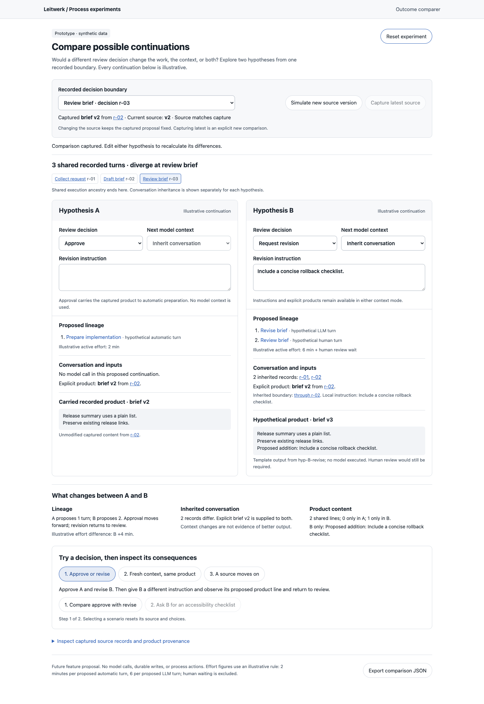
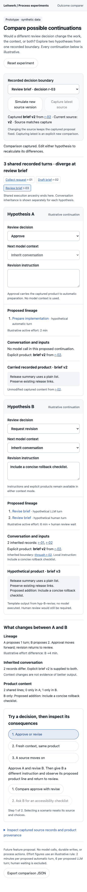

# Alternative outcome comparer

Throwaway behavior prototype. Open `index.html` directly in a browser; no install,
server, or network access is needed. All state is synthetic and lives in memory.

The question: can an operator compare two possible continuations at a recorded
review boundary without confusing proposed lineage, inherited conversation, and
supplied products with executed results?

The prototype compares approve/revise routes from two selectable decision
boundaries. Each side has editable revision instructions and a full/fresh
conversation choice. It calculates a shared recorded prefix, proposed turns,
conversation differences, product versions, and line differences. Source links
open the corresponding fixture evidence. Reset restores the fixture, and Export
comparison JSON captures the hypothetical comparison for inspection.

## Walkthroughs

1. **Approve or revise:** A carries the recorded product into automatic preparation;
   B proposes revision and another human review. Change B's instruction to see its
   proposed product change. Blank instructions expose missing guidance.
2. **Fresh context, same product:** both sides request revision. Make B fresh: its
   inherited conversation drops from two records to zero, while brief v2 and the
   revision instruction remain supplied. The template product stays the same;
   the experiment makes no claim about real model quality.
3. **A source moves on:** advance the simulated source from brief v2 to v3. The
   captured comparison remains on v2 and displays a stale marker. Capture latest
   explicitly takes v3; the simulated newer product has its own source reference.

Free play also supports switching to the later implementation review, producing
five shared recorded turns and change v1 as input. New source versions update a
separate fixture source registry; they never mutate the five frozen tree records.
Changing hypotheses never creates executed turn records or changes process state.

## Potential integration seams

- `packages/domain/src/domain-model.ts`: `ProcessTurnRecord` parentage and path
  type would provide recorded ancestry. A hypothetical node must remain separate
  from an accepted worker execution record.
- `packages/process-sdk/src/flow.ts`: `freshPrimary()` and `fullPrimary()` describe
  model context choices. Structural tree ancestry alone cannot determine context.
- `docs/process-sdk.md`: named products retain source-turn references; product
  publication and consumption require process-defined contracts. The hardcoded
  fixture routes here do not infer real process outcomes.
- `docs/ui.md`: execution Context separates conversation, supplied product versions,
  and local input. Fresh context still allows explicit products and instructions.
- `packages/ui/src/pages/process-detail/inspector/ProcessReference.svelte` and
  `packages/ui/src/lib/instance-tree-layout.ts`: a future read-only comparison
  could use the inspector's context-map evidence and navigation conventions.

Visual references: `packages/ui/PRODUCT.md` and `packages/ui/DESIGN.md`.
No application package, configuration, dependency, or shared contract changes.

## Validation

- Biome check passes for the standalone HTML, including its script.
- Extracted inline JavaScript passes `node --check`; `git diff --check` passes.
- Real Chrome interactions exercised all three walkthroughs, boundary selection,
  text editing, multiline product differences, and reset.
- Observed fresh B: zero inherited records, explicit brief v2 retained. Observed
  stale source: current v3, captured v2, unchanged proposed content until recapture.
- At 390px, edited B, selected fresh context, navigated scenario tabs with the
  keyboard, and opened the exact source record through its provenance link.
  Document width remained 390px, with no horizontal overflow. Export produced
  its completion feedback without a browser exception.
- Captured and opened both screenshots for visual review. Browser error log was
  empty. Full application validation was not run: this is an isolated standalone
  helper under the repository's scoped validation policy.

## Provisional learning and limits

Comparing route, conversation, and product as separate dimensions makes the fresh
context case understandable. An explicit capture and stale marker keep a proposal
stable when its source moves on. This is a design hypothesis demonstrated by the
fixture, not usability research or a production implementation decision.

Revision content is a deterministic template that appends the operator's guidance.
No LLM runs, quality prediction, real cost estimate, process mutation, or durable
storage exists. Effort uses an openly stated illustrative rule: two minutes per
proposed automatic turn and six per proposed LLM turn, excluding human waiting.
The comparison only models the next fixture continuation, not arbitrary process
graphs, retries, mapped turns, unknown context, or concurrent approval races.

390px mobile view

