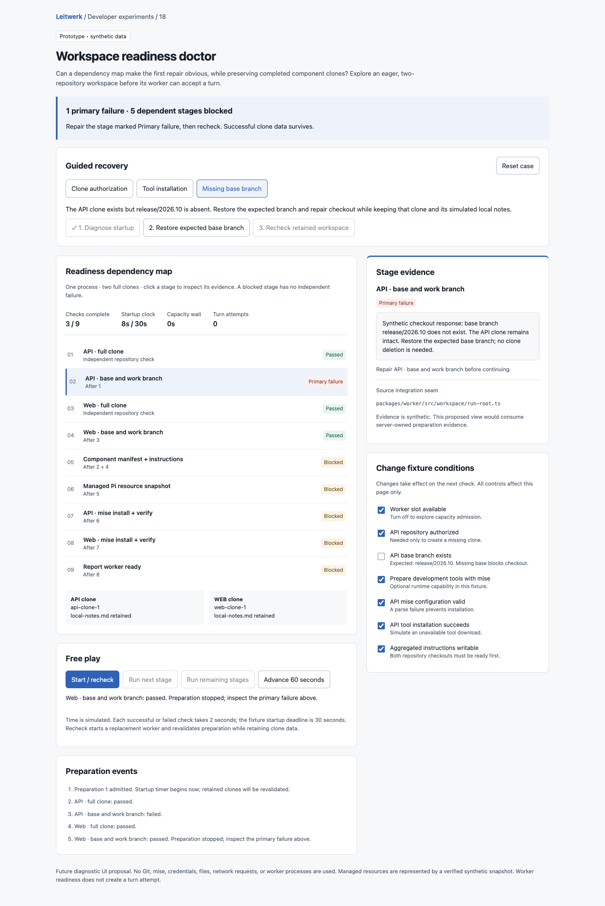
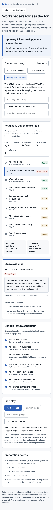

# Workspace readiness doctor

A throwaway developer UX experiment: can a dependency map identify the first actionable workspace repair while making retained repository data explicit?

Open `index.html` directly in a current browser. It is a single offline HTML file with synthetic, in-memory state. No build, server, Git operations, mise commands, credentials, or application changes are involved.

## What to try

The three guided cases reset to known fixtures. Press each numbered step:

1. **Clone authorization:** an API authorization failure blocks its checkout and downstream preparation. The independent Web clone and checkout finish. Authorize API access and recheck; the Web clone keeps its identity.
2. **Tool installation:** both repository checkouts succeed, then API mise installation fails. Restore the download condition and recheck; both clone identities and local notes survive.
3. **Missing base branch:** the API clone succeeds but its expected base branch is absent. Restore the branch and recheck without deleting either clone.

Free play offers individual checks, a complete preparation run, resets, stage inspection, and independent condition switches. Disable the worker slot and start: advancing 60 seconds grows capacity wait while startup time stays at zero. Admit a worker, complete a clone, then advance time: startup times out and the clone remains available for a replacement worker.

A malformed mise configuration and an unwritable aggregate instruction file have their own evidence. Disabling optional tool preparation marks its stages skipped. Changing fixture conditions during preparation requires a fresh recheck so one preparation does not silently mix different inputs.

## Model and integration seams

The pure `initial`, `resolve`, `outcome`, `transition`, `runAll`, and `guided` functions precede the DOM shell. A dependency walk distinguishes direct failures, upstream blocks, completed checks, skipped capabilities, and executable checks. Component clone identities are separate from per-worker preparation results.

This is a future diagnostic view, not an integration. Relevant existing seams are:

- `packages/worker/src/workspace/run-root.ts`: component materialization, checkout, manifest validation/repair, and instruction aggregation.
- `packages/worker/src/workspace/node-run-root-git-ops.ts`: full-clone and checkout operations.
- `packages/worker/src/workspace/resource-aggregator.ts`: aggregated instruction provenance.
- `packages/worker/src/managed-pi-bootstrap.ts`: managed Pi resource verification.
- `packages/worker/src/development-tool-environment.ts`: sequential root-level `mise install`, current-tool verification, bounded evidence, and error codes.
- `packages/worker/src/runtime/bootstrap.ts`: preparation orchestration and worker-ready evidence.
- `packages/server/src/supervisor/worker-capacity-queue.ts`: capacity admission.
- `packages/server/src/supervisor/worker-supervisor.ts`: admitted-worker startup deadlines and recovery.
- `docs/process-workspace.md` and `docs/server-worker-lifecycle.md`: workspace retention and startup contracts.

The fixture models one process with two full clones. It has no turn acceptance action, so the turn-attempt count remains zero. In production the server would own the read model; workers would report bounded preparation evidence through the existing runtime boundary.

## Observed validation

- Biome check passed for the standalone HTML; inline JavaScript passed `node --check`; `git diff --check` passed.
- A real Chromium session exercised all three guided failures and repairs to readiness. Branch and mise repairs retained both clone identities and local notes; authorization repair reused the completed Web clone.
- Browser checks confirmed capacity waiting does not start the startup clock, admitted timeout preserves the clone, and a replacement reaches readiness.
- Browser checks confirmed malformed mise configuration produces actionable evidence and disabling optional mise preparation allows readiness with explicit skipped stages.
- Desktop (1440 px) and mobile (390 px) screenshots were captured and visually inspected. The mobile page has no horizontal overflow; stage evidence follows the dependency map.

These focused checks cover the standalone experiment. Application full validation was not run because application code, dependencies, and runtime/build configuration are unchanged.

## Provisional learning and limits

The promising interaction is to focus the primary failure automatically and show blocked stages as consequences. Keeping clone identities beside the map makes the recovery promise concrete. An operator review is still needed to establish whether this reduces diagnosis time.

Durations, repository names, tool versions, HEAD values, clone identifiers, and errors are synthetic. The dependency map simplifies bootstrap ordering into diagnostic stages; it is not a trace of production execution. Rechecks revalidate preparation while retaining clone identities. Real filesystem repair, credentials, cancellation, corrupted repositories, branch safety with dirty tracked files, Pi snapshot failures, and on-demand repository checkout are outside this experiment. Local notes are a retained-data marker, not a tested filesystem guarantee.

Mobile diagnosis

