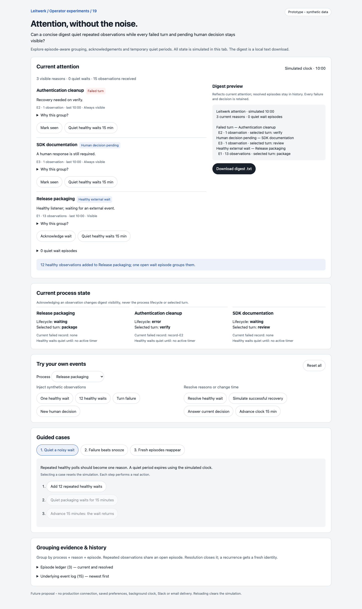
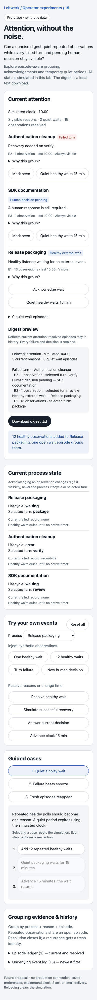

# Attention digest composer

Prototype 19 asks: can a concise operator digest suppress repeated healthy observations while preserving every current failure and pending human decision?

Open `index.html` directly in a browser. It is a self-contained, in-memory experiment with synthetic process data. No installation, server or credentials are needed. Reload or **Reset all** restores the fixture.

The digest groups observations by process, attention reason and episode. Repeated observations join an open episode; resolution closes it. A recurring issue gets a fresh identity. Acknowledging a healthy wait quiets that episode. A process-level 15-minute quiet period covers healthy waits until the simulated clock advances. Failures and pending decisions stay visible even when acknowledged or snoozed.

The current process panel keeps lifecycle, selected turn, current failed record and quiet timer separate from history. A failure sets lifecycle to `error` without changing the selected turn. **Simulate successful recovery** stands in for a completed infrastructure retry; it is not a new process-defined action. The preview and downloaded text contain the same current reasons, including marked-seen failures and decisions. Resolved episodes remain in the ledger and underlying event log.

## Walkthroughs

1. **Quiet a noisy wait:** add 12 observations to the existing wait. Thirteen observations form one group. Quiet it, then advance 15 minutes to restore its visibility.
2. **Failure beats snooze:** quiet Release packaging, inject a failure, then mark it seen. The failure stays visible with lifecycle `error` and selected turn `package`.
3. **Fresh episodes reappear:** acknowledge and resolve a wait, then recur it. Mark the current SDK decision seen and replace it with a newer decision. Recover and recur the authentication failure. The new wait, decision and failure receive new episode IDs; old acknowledgements remain in history.

Free play supports process selection, single/burst observations, failures, new decisions, explicit resolutions, simulated time, acknowledgement, quiet periods and restoration. Open **Why this group?** to inspect each grouping rule, or inspect the complete episode ledger and event log.

## Integration seams

These are source locations for a future implementation, not dependencies of this experiment:

- `packages/domain/src/domain-model.ts`: `ProcessInstance`, `ProcessTurnRecord` and `ProcessLifecycleStatus` own durable lifecycle, selected-turn and execution identity. A production episode must use actual turn-record or decision identity instead of this fixture's counters.
- `packages/ui/src/lib/process-row-view.ts`: existing process overview display combines lifecycle and selected turn. The digest could link each reason to its process without changing that model.
- `packages/ui/src/lib/processes.svelte.ts`: process client state is a candidate input for reconciling current attention after updates or reconnects.
- `packages/protocol/src/ws-event-payloads.ts`: existing turn-record correlation readers illustrate the execution identity needed when consuming events.
- `packages/ui/src/pages/process-detail/ProcessDetailChronicle.svelte`: current decisions and recovery belong to their owning turn; the digest should navigate there for real actions.

## Validation and observations

Validated in an isolated `agent-browser` session against the local file:

- All three guided cases completed. The noisy-wait case changed from 3 visible reasons to 2 visible / 1 quiet, then back to 3 at 10:15, preserving 15 total observations.
- A failure introduced during snooze remained visible after acknowledgement, with `error`, selected turn `package`, and current failed record `record-E4`.
- Recurrence produced fresh wait E4, decision E5 and failure E6 while E1–E3 remained resolved in the ledger. New episodes had no inherited acknowledgement.
- At 390px, acknowledgement followed by another burst left the 25-observation wait quiet. Keyboard Enter on **Restore wait** returned it to the digest. Document width equaled viewport width, with no horizontal overflow.
- The local `.txt` download was saved and read back; it included all three current reasons after recurrence and excluded resolved episodes. No browser errors were reported.
- Desktop (1440px) and mobile (390px) screenshots were captured and visually inspected.
- Repository Biome check, extracted inline JavaScript `node --check`, and `git diff --check` passed. Application validation was not run: this isolated helper changes no application package, dependency, build or runtime configuration.

Mobile screenshot

## Provisional learning and limits

Episode-scoped acknowledgement is a useful boundary: it quiets repetition without carrying silence into the next occurrence. Priority protection must be evaluated before quiet preferences. Current state and historical evidence need separate surfaces so resolved failures do not read as active incidents.

This is a proposal, not a production integration. Events are local ordered fixture observations, not real transport messages. There is no persistence, background scheduling, delivery service, retry engine, real decision submission, duplicate-delivery handling, or server reconciliation. A newer decision explicitly supersedes the prior fixture decision; production may need several simultaneous decisions. The simulated state permits independent attention reasons on one process to stress visibility policy, and does not model a complete turn graph. Real episode keys, replay ordering, ownership of preferences and reconnect behavior remain design work.
