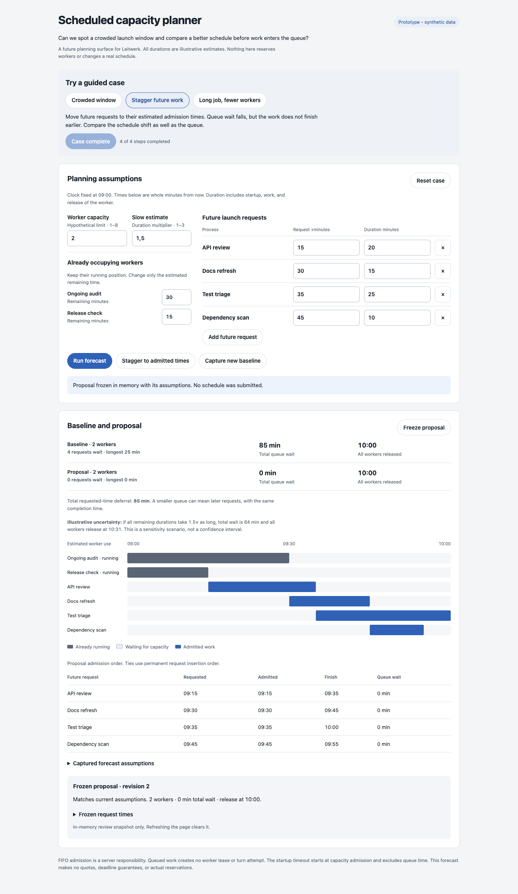
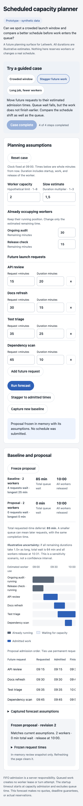

# Scheduled capacity planner

Throwaway, runnable prototype using synthetic data. Open `index.html` in a browser;
no server, dependencies, account, or build is needed. State exists only in memory.

**Design question:** Can an operator spot a crowded launch window and compare a
better schedule before work enters the worker-capacity queue?

The prototype forecasts FIFO admission, shows a baseline beside a proposal, and
freezes the proposal's assumptions for review. It never changes real schedules,
reserves workers, applies quotas, or modifies Leitwerk configuration.

## Interactions

Edit worker capacity, future request times, illustrative worker-occupancy durations,
remaining time for current workers, and the slow-duration multiplier. Add or remove
future requests, run a forecast, stagger requests to their estimated admission
times, capture a new comparison baseline, and freeze a proposal. Reset restores
the selected case.

The pure `Planner` functions are separate from DOM rendering. Future requests sort
by requested time and permanent insertion sequence. The simulation admits each
request only when occupied workers fall below capacity. Current jobs retain their
position even when a hypothetical limit is reduced below current occupancy.
One request occupies one worker until its estimated finish, including allocation,
startup, execution, and release. Equal-time releases happen before new admission.

The timeline shows current occupancy, queue wait, and admitted work. The table
shows requested/admitted/finish times and wait. It scrolls horizontally on narrow
screens. Editing any assumption marks the previous forecast and frozen snapshot
stale; stale or invalid forecasts cannot be frozen or captured as a baseline.
Frozen snapshots retain their original capacity, estimates, schedule, and results.

## Guided walkthroughs

1. **Crowded window:** forecast four requests with two occupied workers. Both
   requests at 09:05 preserve their insertion order. Total wait is 85 minutes,
   with all workers released at 10:00. Try three workers, observe the stale
   forecast, then reforecast: total wait becomes 35 minutes and release is 09:50.
2. **Stagger future work:** forecast, stagger future requests, reforecast, and
   freeze. Total queue wait falls from 85 minutes to zero; requested-time deferral
   totals 85 minutes and final release stays at 10:00. This is a schedule change,
   not a throughput gain. A 1.5× duration scenario still produces 64 minutes of
   queue wait and release at 10:31.
3. **Long job, fewer workers:** start with a 90-minute remaining audit, then
   reduce capacity to one. Neither current worker is interrupted. The first
   future admission waits until 10:30. Total wait is 435 minutes and final
   release is 11:40; the 1.5× duration scenario reaches 674 minutes and 13:01.

For an invalid-input case, freeze a valid forecast, then set capacity to zero and
run the forecast. The error explains the 1–8 integer range; the frozen snapshot
stays unchanged and is marked stale. Blank, fractional, negative, or excessive
request/duration inputs are also rejected. Removing every request requires adding
one before forecasting. Fixture bounds keep this small: eight future requests,
requests within 720 minutes, occupancy durations 1–240 whole minutes, capacity
1–8, and slow multiplier 1–3. These are demo input bounds, not proposed quotas.

## Possible integration seams

- `packages/server/src/supervisor/worker-capacity-queue.ts`: authoritative FIFO
  admission counts active workers and in-flight allocations; it revalidates
  current starts and skips canceled/superseded work. A future read-only forecast
  would need a current snapshot from this owner rather than an independent queue.
- `packages/server/src/future-execution-scheduler.ts` and
  `packages/server/src/future-execution/execution.ts`: scheduled work becoming due.
  A real planner must account for actual due-work ordering and recurring schedules.
- `packages/server/src/routes/future-executions.ts`: existing future-execution API;
  forecast reads and proposal application would need explicit contracts here.
- `packages/ui/src/pages/FutureLaunchDetailPage.svelte`: existing operator surface
  for future launches; the proposed planner could be linked from scheduled work.
- `docs/configuration.md`, Worker supervision: `workers.max_parallel_processes`
  counts allocated and allocating workers; `startup_timeout` excludes queue time.
- `docs/server-worker-lifecycle.md`, Worker capacity admission: a queued request
  creates no lease or turn attempt, and startup timeout begins at admission.

No shared contracts, runtime settings, core packages, or production UI are changed.

## Validation and provisional learning

Checked the inline script with `node --check`; Biome HTML check and
`git diff --check` pass. Used an isolated `agent-browser` session to drive all
three guided cases and verify their results, invalid capacity, stale forecast,
and unchanged frozen snapshot. Captured and opened desktop (1440px) and mobile
(390px) screenshots after the staggered case. The table uses local horizontal
scrolling on mobile. Impeccable's detector returned no findings in its degraded
regex mode; its parser dependencies were unavailable, so this is not a full
accessibility audit. Application `test:full` was not run: this isolated standalone
helper follows AGENTS.md section 7 scoped validation.

The experiment supports showing requested-time deferral beside queue wait:
staggering can make the queue look healthier without finishing any work earlier.
Current occupancy must stay visible when reducing proposed capacity, and frozen
assumptions must stay distinguishable from a live forecast.

Limits: all estimates are illustrative and deterministic. The slow multiplier is
a sensitivity scenario, not a probability or confidence interval. There is no
telemetry, cron expansion, startup-failure/retry simulation, cancellation race,
worker retention, process dependency graph, restart reconciliation, wall-clock
advance, or durable proposal storage. Real duration estimates and schedule edits
need further product and architecture decisions. This prototype should remain a
throwaway branch; no production adoption is implied.

Mobile screenshot

