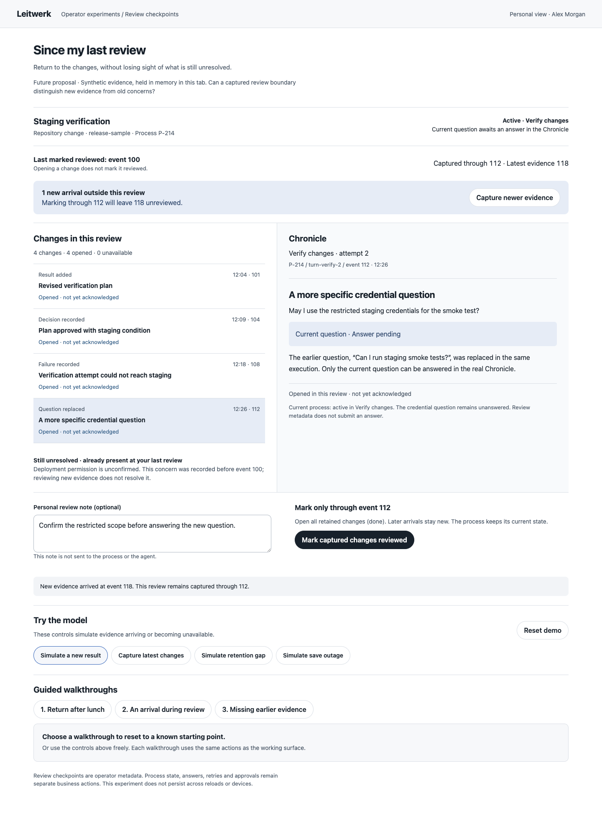
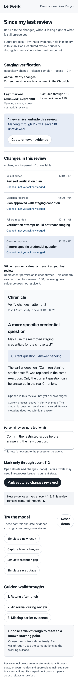

# Since my last review

A throwaway operator experiment for personal review checkpoints. Open
[index.html](index.html) directly in a browser; it needs no server, build, network
or application installation. Everything is synthetic and held in this tab's
memory. Reloading or resetting discards review state and notes.

An operator returning after lunch may see the same waiting question while the
underlying result, decision or failure evidence has changed. The design question
is: **can a bounded review help distinguish old unresolved work from new evidence
without rereading the whole process?**

Unlike an attention digest, notification policy or summary packet, the central
object is a personal acknowledgement of a captured evidence boundary. Opening a
page or reading an entry is not acknowledgement. The unchanged deployment concern
remains visible after all new changes are reviewed.

## Working model

- Open results, decisions, failures and replacement questions at their exact
  simulated Chronicle execution. Each entry keeps its execution and event identity.
- Explicitly mark the captured changes reviewed after opening their retained
  evidence. Reading alone leaves the saved marker unchanged.
- Let another result arrive while reviewing. A save through event 112 leaves event
  118 new; capture, open and acknowledge it separately.
- Keep an optional personal note with the latest receipt. Arrivals, evidence
  navigation and refused saves preserve the unsent draft. A successful save moves
  the note to its receipt and clears the draft.
- Simulate retention. The original source identity remains unavailable across
  inspections. Acknowledging a disclosed gap permits a receipt that explicitly
  says the missing content was not inspected.
- Simulate an unavailable save service. Restore saving and retry with the same
  note and opened evidence. Reset returns to the initial fixture.

The first inline script contains the pure `ReviewModel` reducer and projections.
The second renders them and wires controls. Business lifecycle and question state
are separate fixture facts. No review operation answers the question, retries a
turn, grants permission or advances the process.

## Walkthroughs

Each scenario button resets the fixture. Use the single advancing step button to
perform each real model action. A step advances only for its expected outcome;
an outage refusal does not satisfy the retention-refusal step.

1. **Return after lunch:** open events 101, 104, 108 and 112, then mark through 112.
   Reading keeps the marker at 100. Acknowledgement leaves the deployment concern
   unresolved and the credential question unanswered.
2. **An arrival during review:** open the four captured changes, simulate event
   118, and mark through 112. The later result stays new. Capture and open 118,
   then mark the new boundary.
3. **Missing earlier evidence:** remove event 101, attempt a save and observe its
   refusal, inspect the unavailable source, acknowledge the gap, open retained
   evidence and save a receipt that names the missing event.

## Integration seams and proposed contracts

These paths were checked against the source; this prototype does not call them.

| Existing seam | Proposed use |
| --- | --- |
| `packages/protocol/src/http-contracts.ts`: `PrimaryPathUiSnapshot.throughEventSequence` and `ProcessTimelineSnapshot` | Bound a typed change projection to the captured cursor and link summaries to exact turn records. |
| `packages/server/src/db/schema.ts`: `processEvents.eventSequence`, `instanceId`, `turnRecordId` | Query durable evidence for one process between the previous marker and captured boundary. Event sequence is globally unique; a numeric gap alone does not prove retention. |
| `packages/server/src/routes/process-detail.ts`: process detail and primary-path routes | Read the current snapshot alongside a new bounded change projection. |
| `packages/server/src/process-inspection-reader.ts` | Resolve exact retained execution evidence and semantic event items. |
| `packages/ui/src/lib/router-logic.ts`: `buildInspectorPath` and `readInspectorTarget` | Preserve process, execution, entry and item identity when following evidence. |
| `packages/ui/src/pages/process-detail/ProcessDetailChronicle.svelte` | Keep the Chronicle as the canonical evidence and business-action surface. |

A real feature would need an actor-and-process-scoped review-marker table with an
explicit migration and a typed change projection. Its save request must carry the
captured boundary; the server must never replace that value with its latest event.
A monotonic compare/update would prevent older tabs from moving a marker backward.
Authenticated actor identity and cross-device persistence need a defined contract;
anonymous mode cannot pretend to distinguish different people.

Retained metadata, source availability and retention gaps need an explicit server
contract. Missing sequence numbers are not evidence of deleted content. The sample
keeps summary tombstones to explore that contract; current retention is not claimed
to preserve those summaries. Opening every row is an experimental review gate,
not proof a person understood the content. Review metadata adds no permissions or
business transitions.

## Observed validation

- Biome checked the standalone HTML; both inline scripts were extracted and passed
  `node --check`. `git diff --check` passed.
- Actual browser clicks completed all three guided scenarios. The race check
  observed marker 112 and event 118 still unreviewed before its later capture.
- Free play verified unread-change refusal, save-outage refusal and recovery,
  note preservation across arrivals and rejected saves, note transfer to a receipt,
  unchanged markers while reading, and unavailable evidence across reinspection.
- An unrelated outage did not advance the guided step that expected a retention
  refusal. Restoring saving and observing the expected refusal did advance it.
- Desktop 1440px and mobile 390px screenshots were captured from the working file
  and visually inspected. The mobile document has no horizontal overflow. Browser
  error output was empty.
- The Impeccable detector ran once and returned no regex findings in degraded
  mode: HTML parser dependencies were unavailable, so it did not evaluate computed
  contrast, selector matching or custom properties.

Application `test:full` was not run: this isolated, dependency-free artifact does
not change application code, contracts or build/runtime configuration.

## Provisional learning and limits

A fixed review boundary makes a concurrent arrival understandable without making
old unresolved work disappear. Retention needs its own acknowledgement and receipt
language; treating every acknowledgement as proof of reading would overstate the
evidence. These are model observations, not results from operator usability tests.

The demo has one fictional actor and process, synchronous simulated saves and only
the latest review receipt. It has no durable store, actual Chronicle navigation,
server concurrency, authentication, polling or websocket integration. Production
adoption would need to settle retention policy, cross-device conflict semantics
and whether requiring every retained row to be opened helps real operators.

