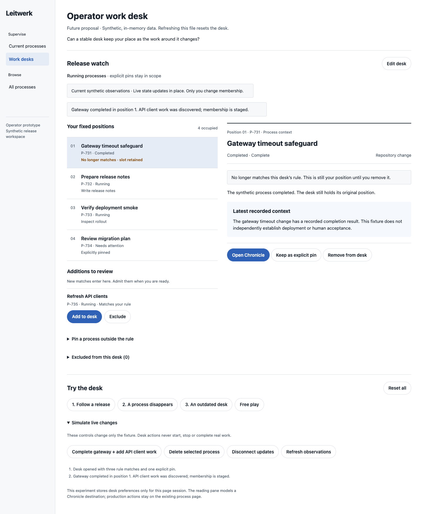
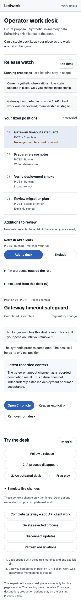

# Operator work desk

A throwaway operator prototype for a named supervisory scope with stable process
positions. During a release, operators may follow several unrelated processes
whose ordering changes whenever a global process list refreshes. This desk keeps
identity and order steady while observations update in place.

**Design question:** Can a stable desk reconcile dynamic membership with operator
spatial memory without letting obsolete processes become invisible clutter?

This is a future proposal using synthetic, in-memory fixtures. Open `index.html`
by double-clicking it. No server, installation, network access or credentials are
required. Refreshing the file discards the desk. `Reset all` restores the fixture.

## What to try

- Rename the desk and change its status or title rule. Saving stages newly
  matching processes without removing existing positions.
- Open a row's synthetic Chronicle and return to the same selection. On mobile,
  selection scrolls to the reading pane and return restores focus to its row.
- Simulate completion and incoming work. The completed gateway stays in position
  1 with a no-longer-matching label. API client work waits in the additions tray.
- Admit, exclude or reconsider candidates. Pin a process outside the rule.
- Remove a position after inspecting its explicit confirmation. This changes desk
  membership only, records an exclusion and preserves remaining position numbers.
- Simulate deletion or disconnection. Deleted entries retain their identity and
  show unavailable evidence. Stale observations remain labeled during inspection;
  candidate admission is refused until observations are refreshed.

The fixture controls are separate from desk actions. There are no process mutation
forms, approvals, bulk actions or permission changes in this prototype. Editing a
desk does not change a process lifecycle. Unsaved desk edits survive unrelated
updates, inspection and refused actions.

## Guided walkthroughs

Each scenario starts from a known fixture. Its step button performs the actual
model action. A step advances only on its intended success or specified refusal.

1. **Follow a release:** open the gateway Chronicle, return, simulate completion
   plus new work, then admit the newcomer. The first four identities stay ordered;
   the new process enters position 5.
2. **A process disappears:** select release notes, simulate deletion, observe the
   refused Chronicle opening, then review and confirm removal. The tombstone
   stays visible until confirmation; other position numbers remain unchanged.
3. **An outdated desk:** discover new work, disconnect, try admission and observe
   refusal. Inspect and return while evidence stays stale. Refresh, then admit.

`Free play` exits guidance without resetting the current state. Starting a new
scenario resets it. If free play changes the selected process needed by a guided
step, the walkthrough asks for the correct identity and keeps its current step.

## Integration seams

The source was inspected at base `050a860b016a00db2eab6ceec31bf21885a6165f`.

| Existing seam | Proposed use |
| --- | --- |
| `packages/ui/src/lib/process-row-view.ts` — `ProcessRowView`, `buildProcessRowView` | Reuse compact process identity, lifecycle and turn labels. The desk owns order instead of applying `sortProcessRowViews`. |
| `packages/ui/src/lib/processes.svelte.ts` — `processRows`, scheduled list/browse reloads | Update observations by process ID while keeping the saved slot sequence. |
| `packages/ui/src/lib/api.ts` — `ProcessBrowseRequest`, `fetchProcessBrowse` | Resolve candidates through current status/type/text browsing. The prototype implements only status and title rules. |
| `packages/ui/src/lib/process-browser.ts` | Reuse status presentation and browser preference conventions. Its existing preference is a browser view, not a named desk. |
| `packages/ui/src/lib/router-logic.ts` — `/processes/:instanceId` | Open the canonical process destination and retain the desk selection on return. The file models that destination locally. |
| `packages/ui/src/shell/Sidebar.svelte` | Existing process links demonstrate identity-based navigation. |
| `docs/operator-guide.md` | Chronicle inspection, lifecycle interpretation and deletion semantics remain authoritative. |

Named desks, ordered IDs, explicit pins/exclusions, deletion tombstones and
cross-device preference storage would be new operator metadata contracts. A
server-persisted implementation needs an explicit schema migration and a policy
for concurrent preference edits, observation freshness and deleted-title retention.
These preferences would not create access rights or tenant isolation. Workers
would not own desk state. Existing server coordination, accepted-turn correlation
and external-write idempotency remain unchanged.

## Difference from the previous ideas

This is a saved supervisory workspace with deliberate membership and order. It
adds spatial continuity across live updates, rather than another attention rank,
digest, notification policy or batch decision surface. A global browser still
serves discovery; the desk remembers the operator's chosen operational scope.

## Observed validation

- Biome HTML checks passed; all inline scripts extracted and passed `node --check`.
  `git diff --check` passed.
- Browser clicks completed all three guided walkthroughs at desktop 1440×1050
  and mobile 390×844, including the expected deletion and stale-admission refusals.
- Free-play checks covered rename/filter saving, empty-name refusal, draft
  retention across live updates and refused admission, explicit pinning, exclusion
  and reconsideration, removal cancellation and reset.
- A deliberately wrong selection did not advance its guided step. Mobile row
  selection reached the reading pane; Chronicle return focused the same identity.
- Mobile had no horizontal overflow; visible buttons met the 44px minimum height.
  The isolated browser reported no page errors.
- Both final screenshots were opened and visually inspected. The detector ran
  once in degraded regex mode because HTML parser modules were unavailable. It
  returned no findings; computed contrast and selector analysis were unavailable.

No application code, shared contracts, dependencies or runtime configuration
changed. Full application validation was not run under the standalone helper
policy. This is not production integration or a user study.

## Provisional learning and limits

Separating new matches from occupied positions makes the completion/new-arrival
race understandable: a newcomer never silently replaces a familiar identity.
Retained slots need a visible reason and a deliberate removal path to avoid
becoming forgotten clutter. Explicit exclusions also prevent removed matching
processes from immediately returning to the tray.

The experiment has one desk, small bounded fixtures and no persistence, real
routing, multi-operator synchronization or network races. Simulated refresh is
immediate. It does not evaluate large-fleet scanning, long-lived tombstone
retention or preference conflict handling. The interaction checks support the
state model; operator testing is still needed to judge sustained spatial memory.

