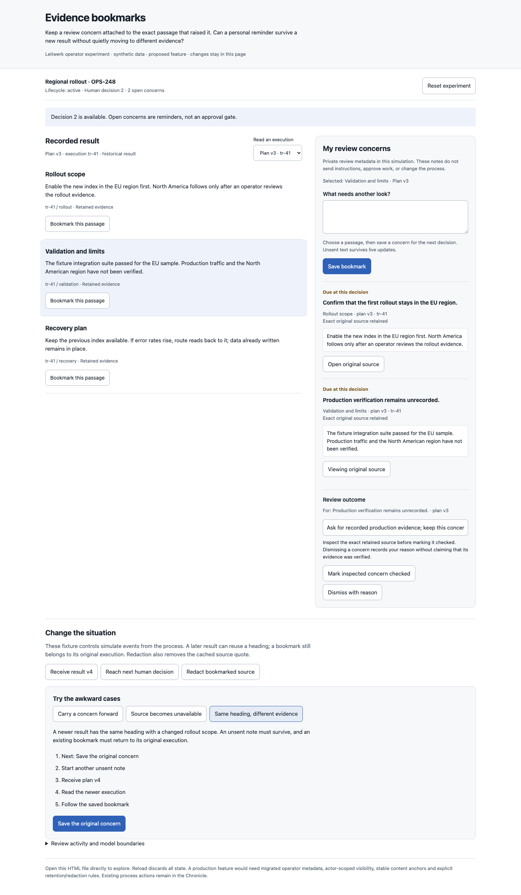
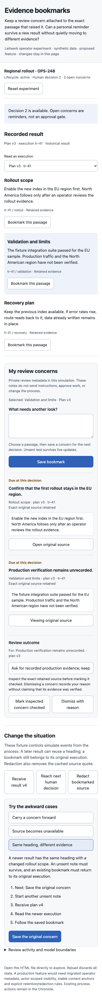

# Evidence bookmarks

An operator reading a long result needs to keep a concern attached to the exact evidence that raised it. This standalone experiment asks whether that reminder can survive later results, unavailable sources and a new human decision without silently referring to different work.

Open `index.html` directly in a browser. It has no dependencies, network access or persistence. All content is synthetic. Reload or Reset experiment restores the fixture.

Unlike the earlier attention digest and review evidence packet, this idea keeps an unresolved personal concern beside its source. A bookmark neither sends instructions nor submits a business action. Requesting revisions is a separate operator workflow.

## Try it

Choose a passage in the recorded plan, write a concern, and save a bookmark. Simulate another result or human decision. Open the bookmark to return to its original execution, then enter a review outcome and mark it checked or dismiss it with a reason. Completed concerns can be reopened.

Three guided scenarios cover:

1. **Carry a concern forward:** keep a v3 bookmark while v4 arrives, surface it at the next decision, and inspect the original passage before recording a review.
2. **Source becomes unavailable:** redact the bookmarked source and its cached quote. Marking unavailable evidence checked is refused; dismissing with an explicit reason remains possible and never implies verification.
3. **Same heading, different evidence:** open a newer result with the same heading, then follow a bookmark back to the original execution. The unsent second note survives these changes.

A fresh source does not replace an old anchor. Redacting a previously checked source marks that concern for recheck. Process lifecycle remains `active`; personal review state does not approve, hold, or advance the process.

## Integration seams and proposed contracts

- `packages/ui/src/lib/router-logic.ts`: `buildInspectorPath` identifies execution, entry and item targets without including transcript text in the URL.
- `packages/ui/src/pages/process-detail/inspector/inspector-navigation.ts`: exact execution navigation and retained reading position provide the existing route back to evidence.
- `packages/protocol/src/execution-inspection.ts`: typed execution and entry references identify retained source evidence.
- `packages/server/src/process-inspection-reader.ts`: the server owns evidence reads and unavailable-source behavior.
- `packages/ui/src/pages/process-detail/ProcessDetailChronicle.svelte`: current operator decisions remain in their canonical Chronicle forms.

Production bookmarks would need migrated operator metadata, identity and preference-ownership rules, stable content anchors, and retention/redaction rules covering cached excerpts. Those are proposed additions. This prototype uses exact fixture text as a fingerprint rather than a cryptographic hash. It does not establish cross-device persistence, private access controls, redaction guarantees for operator-written notes, or a way to infer validation from prose.

## Observed validation

Biome, extracted inline JavaScript syntax, and Git diff checks passed. Real Chromium interactions completed all three scenarios with assertions on each step. Free play confirmed unsent note and review-outcome drafts survive updates and refused actions, unavailable sources cannot be marked checked, cached redacted source text is removed, original execution identity remains fixed, and the process lifecycle is unchanged.

Independent review found that outcome drafts needed bookmark identity. The fix stores each draft by bookmark: browser regression checks with two concerns verified switching restores the correct outcome, the second concern cannot use the first concern’s text, successful resolution clears only its own draft, and redaction/refusal preserves the other concern’s draft. All three original guides still pass.

Refreshed desktop 1440px and mobile 390px full-page screenshots were opened and visually inspected. The mobile document width is 390px with no horizontal overflow; the browser error list was empty. The visual detector ran once in degraded regex mode because its HTML parser dependencies are unavailable; it returned no findings but did not evaluate computed contrast.

Scoped helper validation applies. No application code, dependencies or runtime configuration changed, so local application `test:full` was not run.

## Provisional learning

Showing the source execution beside the concern makes later result changes concrete. Separating checked from dismissed preserves the difference between inspected evidence and a human decision to stop following a concern. Operator testing is still needed to learn whether bookmarks reduce repeated reading without creating another task inbox.

Mobile screenshot

