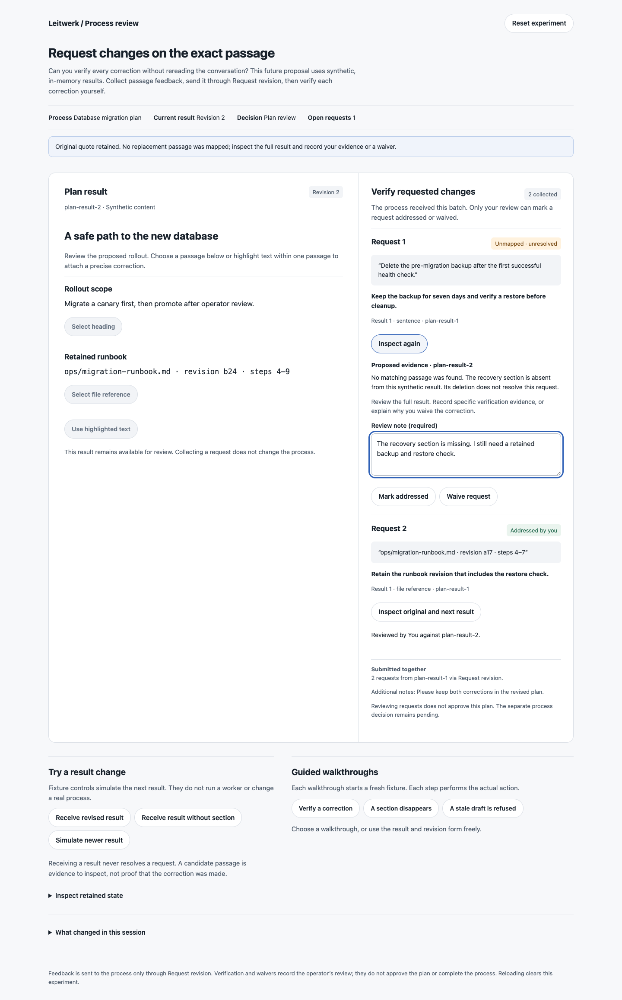
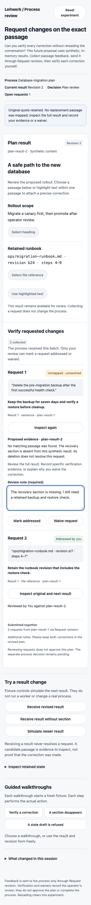

# Passage-anchored revision feedback

An operator finds several problems in a result, but a freeform revision message loses the passages those corrections refer to. This throwaway experiment asks: **Can operators verify that each requested correction was handled without reading the whole conversation again?**

Open `index.html` directly in a browser. It is one self-contained HTML file with synthetic, in-memory data, inline styling, and two inline scripts: a pure state model and a DOM shell. No installation, server, network, or production process is required. Reload or **Reset experiment** clears all state.

## What this explores

Read a plan result, select a heading, sentence, retained file reference, or highlighted text within one passage, and write a correction. Collect several requests, add optional batch notes, then submit all of them through **Request revision**. The submitted batch retains each request's quote, source result record, revision, and content fingerprint.

Receive a revised result using the clearly labeled fixture controls. Each request remains unresolved. Inspect its original quote and candidate evidence, then mark it addressed or waive it yourself. Deleting a section produces **Unmapped · unresolved**, preserving the original quote. Verifying an unmapped request requires a review note; every waiver requires a reason. Neither operation approves the plan or completes the process.

This adds precise feedback and verification across the actual revision loop to the earlier operator experiments. It is distinct from idea 24's private reminder bookmarks: these corrections are sent to the process as one explicit revision action, and each submitted request keeps its evidence and operator resolution.

## Interactions

- Select the rollout heading, recovery sentence, or retained runbook reference. Native text highlighting can select a smaller quote inside a single passage.
- Add a nonempty correction to the local collection; remove an unsent request.
- Keep an unfinished request and batch notes while an unrelated result arrives. A rejected action preserves the text.
- Refuse a submission whose source record or fingerprint is stale. Compare the unchanged quote with the new result, then explicitly rebind it before submitting.
- Submit one batch and receive either a complete synthetic revision or one missing the recovery section.
- Inspect requests independently. Review-note drafts survive switching between requests.
- Mark a candidate addressed, verify an unmapped request with written evidence, or waive a request with a reason. Record the operator and reviewed result record.
- Inspect the retained state, read the action history, or reset the experiment.

## Walkthroughs

1. **Verify a correction:** collect backup and runbook corrections, send both in one revision, receive a result, inspect each candidate, and mark each addressed. Both resolutions leave the separate plan decision pending.
2. **A section disappears:** request a backup correction and receive a result without recovery. Inspect the unmapped request; an attempt to verify without evidence is refused. Record a reason and explicitly waive it. The original quote remains visible.
3. **A stale draft is refused:** collect a rollout correction and batch notes, simulate a newer source record, and try to send. The refusal retains all notes. Confirm the unchanged quote, rebind it, and send the retained revision.

Each step uses the same reducer as free play. A walkthrough advances only after its action succeeds or its exact expected refusal and required request state are observed. An empty collection, an already-resolved request, or inspection of another request cannot stand in for the stale-source or missing-evidence refusal.

## Existing seams and proposed additions

These files were inspected at the prototype's base revision. They are integration candidates, not changes implemented by this branch.

| Existing seam | Current contract | Proposed addition |
| --- | --- | --- |
| `extensions/coding/src/actions.ts` — `requestRevisionForm` | A required `message` textarea, labeled Revision notes, submits Request revision. | Include a rendered summary of anchored requests in the existing revision message; define a structured companion payload only through an explicit supported contract. |
| `extensions/coding/src/repository-change-process.ts` — plan decision's `requestRevision` action | The revision action routes to `generate_plan`, queues toward `currentPrimaryPathLeaf`, and emits `plan_revision_requested`. | Accept one revision-bound batch through this action. Preserve normal action validation and server coordination. |
| `packages/ui/src/chronicle/components/ChronicleMarkdown.svelte` | Renders result markdown and applies rich-markdown enhancement. | Expose a supported selection boundary and quote-to-source mapping without changing recorded markdown. |
| `packages/ui/src/chronicle/components/ChronicleActionSection.svelte` | Sends decisions through the action bindings. | Present the collected batch in the canonical action form and submit it explicitly. |
| `packages/ui/src/pages/process-detail/process-detail-action-drafts.svelte.ts` | Owns action fields and a shared primary prompt draft. | Preserve local anchor drafts alongside the shared revision draft during navigation and incoming updates. |
| `packages/domain/src/domain-model.ts` — `ProcessTurnRecord` | Retains the record id, selected turn, lineage, attempt, and result markdown. | Reference the exact source and inspected successor record from a separately defined durable change-request record. |

Durable requests would need a source record, content hash, original quote, location or retained-file identity, batch id, requested correction, next-result mapping evidence, and explicit operator resolution. Candidate mappings must carry their evidence revision and never imply success. Deleted, rewritten, ambiguous, or unavailable passages remain unresolved until an operator verifies or waives them.

A production implementation needs an explicit durable migration and server-owned state. Submitting the batch must use existing exclusive process mutation coordination. Worker results still require normal turn-record correlation; accepted worker start, attempt accounting, and outcome semantics are unchanged. Verification must be an attributed review record, independent of the business lifecycle. This experiment does not add permissions or tenant isolation.

## Observed validation

- Biome check passed for the standalone HTML; both inline scripts were extracted together and passed `node --check`. `git diff --check` passed.
- All three guided walkthroughs completed through real browser clicks. State observations confirmed submitted batch membership, unresolved status on receipt, explicit resolutions, and preservation of notes after stale refusal.
- A focused review-fix browser pass confirmed that no-requests, already-resolved, and wrong-target inspection refusals leave their guided step unchanged. The intended stale-source and missing-evidence refusals advance the correct step; typed notes remain intact. Both screenshots were refreshed and opened after this fix.
- Free play exercised native text selection, heading and file-reference selection, typed corrections, batch notes, empty submission refusal, unsaved-draft preservation when another passage was selected, stale-draft refusal and rebinding, and two-request submission and verification.
- Review notes survived inspecting another request. An unmapped waiver without a reason was refused; the original quote remained unresolved. A later explicit mobile waiver kept `plan_decision / waiting`.
- Desktop at 1440px and mobile at 390px were captured together and both PNGs opened for visual inspection. Mobile had no horizontal overflow and no buttons below 44px height. The browser reported no page errors.
- The Impeccable detector ran once and returned no findings **in degraded regex mode** because its HTML parser modules were unavailable. It did not evaluate computed contrast, selector matching, or custom properties; this is not a full detector pass.
- No application code, dependencies, build configuration, or cross-cutting docs changed. Full application validation and a new test suite were not run under the repository's standalone-helper policy.

## Limits and provisional learning

This models one revision batch per reset, one operator, and a small fixed result. The revision transition is a simulation, not a worker execution. There is no persistence, server integration, real file access, collaboration, authorization change, external write, or timing model. The file reference and successor mapping are synthetic; matching uses fixture passage ids, not a production text-matching algorithm. The displayed fingerprint is explicitly illustrative and non-cryptographic. Browser selection is limited to one retained passage. There is no editing or reopening of a submitted resolution in this experiment.

The scripted and free-play exercises support keeping three facts separate: a correction was sent, a possible replacement passage was found, and an operator verified the correction. The deleted-section case is the useful stress test: retaining the original quote makes the gap reviewable while preventing deletion from silently counting as success. Whether this reduces real operator rereading still needs user observation with realistic long results.
