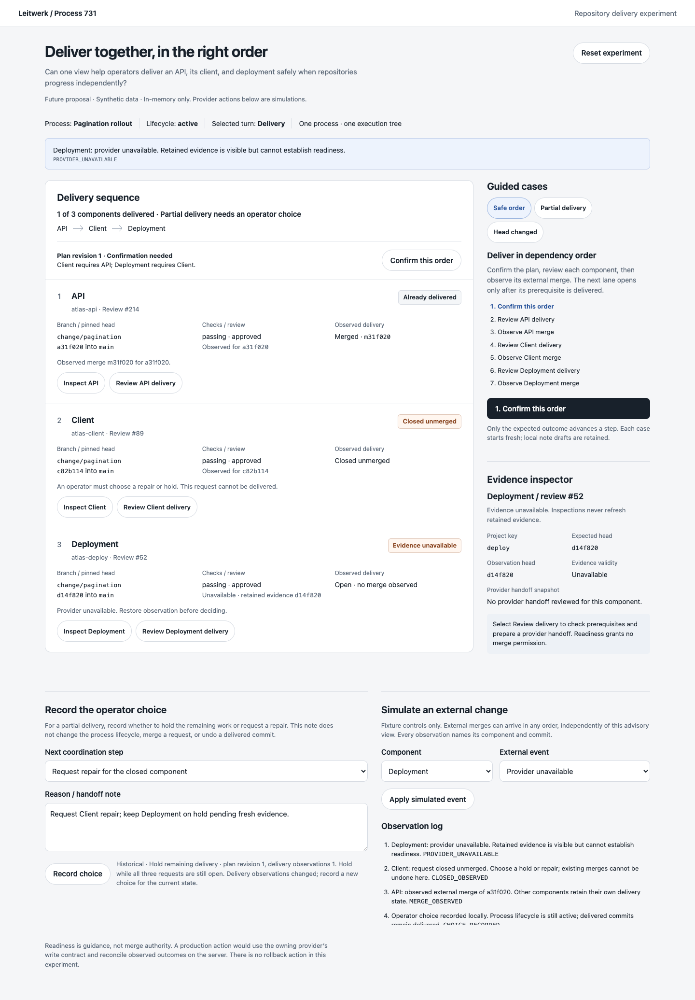
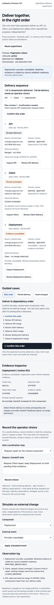

# Coordinated repository delivery

A throwaway operator prototype for one process that changes an API, its client,
and a deployment repository. Open `index.html` by double-clicking it. It requires
no server, build, network access, or installed dependencies. All fixtures and
notes live in memory; reload or Reset experiment clears them.

The design question: **Can operators make correct component delivery decisions
from one view when external systems progress independently?**

The experiment makes delivery order explicit while keeping a single process and
execution tree. Compared with the earlier prototype batch, its focus is the
relationship between repository outcomes: a ready client can still depend on an
undelivered API, and one successful merge can coexist with another request closed
unmerged. It does not split components into separate processes.

## Actions

- Confirm the proposed process-owned order for the current plan revision.
- Inspect each component's branch, head, checks, review, merge conflict, request
  outcome, prerequisite, and retained provider handoff.
- Review delivery readiness and open a simulated provider preview. This performs
  no merge and grants no provider permission.
- Simulate external merges, closed requests, new commits, old-head observations,
  unavailable providers, failed checks, requested changes, and merge conflicts.
- Record an advisory operator choice and reason. Notes survive inspections,
  unrelated updates, rejected actions, and walkthrough changes. Reset clears them.
  Each choice retains the exact component heads, request outcomes, merge commits,
  checks, reviews, and availability it assessed. Changed observations make it
  historical; partial delivery then requires a new choice. Earlier receipts and
  reasons remain in the observation log when a new choice is recorded.

All counts are calculated from the three synthetic repositories. The compact
commit identifiers are fixture labels, not real Git objects. Guided steps use the
same pure reducer as free play. A step advances only for its exact expected
success or specified refusal code.

## Walkthroughs

1. **Safe order:** confirm the order, review API, observe its external merge, then
   repeat for Client and Deployment. Only an observed prerequisite merge enables
   the next component. All three delivered components still await process
   reconciliation; the prototype does not complete the process.
2. **Partial delivery:** observe API merged and Client closed unmerged. Trying
   Client delivery returns `REQUEST_CLOSED`. The last step needs a typed reason;
   `NOTE_REQUIRED` retains the current step and draft selection. Record the
   operator choice. The API remains delivered; Deployment continues waiting.
3. **Head changed:** confirm and review API, then push a new head. Delivery returns
   `EVIDENCE_STALE`; the old-head merge event returns `OBSERVATION_MISMATCH`.
   Inspecting another component and returning retains those labels. Observe the
   current head, confirm the revised plan, and review that exact head again.

Free play also exposes `PLAN_UNCONFIRMED`, `PREREQUISITE_UNDELIVERED`,
`EVIDENCE_UNAVAILABLE`, `CHECKS_FAILED`, `REVIEW_REQUIRED`, `MERGE_CONFLICT`,
`ALREADY_DELIVERED`, and `REQUEST_TERMINAL`. External fixture merges can occur
independently of advisory readiness, as they can in an external provider.

## Integration seams and proposed contracts

These are inspected source seams, not implemented integration:

- `packages/domain/src/domain-model.ts`: `ProcessProject` identifies the process
  component, repository locator, branches, external request, metadata, and pipeline
  status. An actual readiness view needs additional commit-correlated evidence.
- `extensions/coding/src/repository-change-publication.ts`:
  `PublicationEvidence.projectKey`, `RepositoryChangePublicationAdapter.repositories`,
  `observeTerminal`, and `reconcileAll` already preserve independent publication
  state under one process. Terminal facts take precedence over cancellation.
- `extensions/coding/src/repository-change-state-internal.ts`:
  `RepositoryChangeState.extensionState` is the namespaced owner of publication
  workflow state. Its routing `planRevision` is not an existing delivery-prerequisite
  contract; this experiment's delivery revision is proposed.
- `docs/ui.md`, Process inspector: Overview retains recorded repository facts and
  resource links. `packages/ui/src/pages/process-detail/inspector/ProcessInspector.svelte`
  is the current inspector shell.
- `packages/external-writes/src/contracts.ts`: the owning integration's external
  write abstraction remains the boundary for real provider mutations.

A production proposal needs process-owned prerequisite definitions and a delivery
plan snapshot bound to the component heads. Observations need component, request,
head, provider provenance, and observation identity, with explicit unavailable and
stale states. Persist confirmations and advisory choices server-side, separately
from process lifecycle. Bind each choice to its frozen delivery observations as
well as the plan revision. A later material observation invalidates that choice,
even if evidence availability subsequently returns to its former state.
Revalidate observations and the reviewed revision at any
future provider write boundary. Such writes must use the owning provider's retry-safe external-write contract
(`ExternalWrites.ensure` at this source boundary); the display is not merge authority.

This does not change lifecycle semantics, turn acceptance, attempt counting,
turn-record correlation, worker ownership, or authorization. Real server changes
would retain exclusive per-process coordination and reject stale worker outcomes.

## Validation and provisional learning

Observed local browser checks cover all three guided cases, free-play delivery,
prerequisite refusal, unavailable evidence, failed checks, requested changes,
merge conflict, closed-request refusal, ignored old-head evidence, note retention,
and mobile inspection. The final captures use 1440px and 390px viewports and were
opened for visual inspection. Both widths have no horizontal overflow and all
buttons meet the 44px minimum. The browser reported no runtime errors.

The delivery-choice follow-up reproduced a choice recorded before API merged and
Client closed, then verified that those outcomes require a fresh choice while the
plan remains at revision 1. Real browser interactions also confirmed availability
loss and restoration keep old choices historical, fresh choices assess the new
state, and prior receipts and drafts survive inspections and refused actions.
All three normal walkthroughs were repeated, including the missing-reason refusal.

Biome check, extracted inline JavaScript syntax checking with `node --check`, and
`git diff --check` pass. The one Impeccable detector run returned no findings in
**degraded regex mode** because parser modules were unavailable; it did not verify
computed contrast or selector matching. Full application validation was not run:
this standalone artifact does not alter application code or configuration.

Provisional learning: readiness and delivery need separate language. A green
review cannot release a dependent component, and a recorded operator choice
cannot turn partial delivery into completion. Preserving the old head beside the
current head makes revision invalidation understandable without erasing history.
A choice must also identify the delivery observations it assessed: an unchanged
plan revision does not mean independently observed repository outcomes are
unchanged. This is a behavior demonstration, not evidence from operator usability
research.

Limits: no persistence, real provider links, permissions, merge writes, rollback,
repair creation, asynchronous races, clocks, or process reconciliation. Three fixed
components and a fixed dependency chain answer this narrow question. The provider
preview is local explanatory content. Future integration must define how a repair
binds to a new request while preserving previously observed terminal facts.

