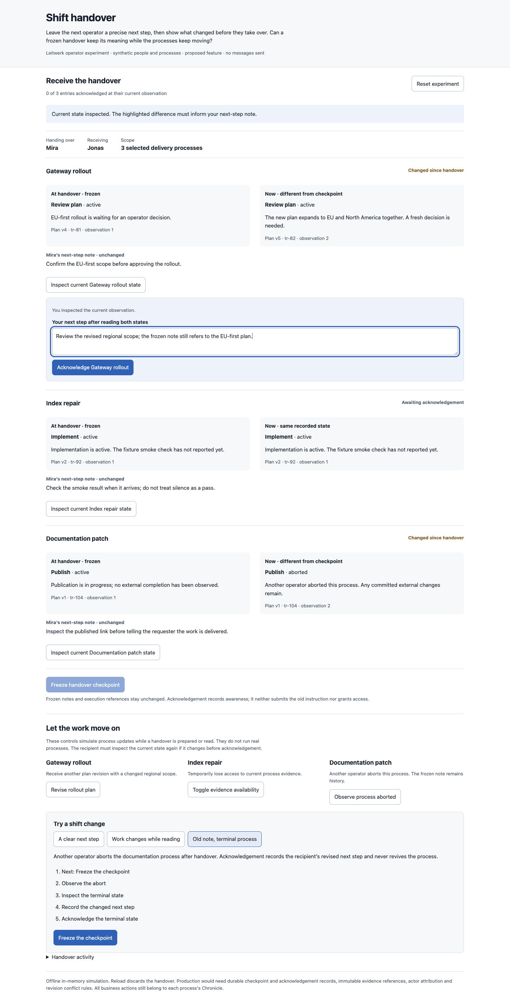
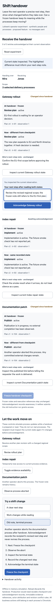

# Shift handover

An operator leaving a shift needs to preserve both the next step they intended and the process state that made that step appropriate. This prototype asks whether a frozen handover stays understandable while processes advance, disappear from view or are aborted.

Open `index.html` directly in a browser. It runs offline with synthetic people, processes and observations. Reset or reload discards the in-memory experiment. No messages are sent.

This differs from the earlier review evidence packet: it carries unfinished commitments to another operator and checks for changed conditions before acknowledgement. Acknowledgement records awareness. It does not submit a business action, grant access, stop work or transfer process ownership.

## Interactions and walkthroughs

Select processes, edit their next-step notes and freeze a checkpoint. The receiving operator sees each immutable note and captured execution beside current observations. Inspect current state, write a next step and acknowledge that observation. Later changes make an old acknowledgement visibly stale without erasing its receipt.

Three guided scenarios cover a normal handover, a revision arriving between inspection and acknowledgement, and a process aborted after capture. A stale acknowledgement is refused until the recipient inspects current state again; their draft survives. Acknowledging an aborted process leaves it aborted.

Free play also changes membership, simulates evidence becoming unavailable, and restores evidence with a new observation. Unavailable current evidence prevents capture or acknowledgement as appropriate. Neither a frozen snapshot nor a prior acknowledgement substitutes for current evidence.

## Integration seams and proposed contracts

- `packages/domain/src/domain-model.ts`: `ProcessInstance.currentExecution`, `planRevision`, lifecycle and `Actor` establish process identity, execution context and attribution.
- `packages/server/src/routes/process-detail.ts`: current and historical process views provide the source observations to capture and compare.
- `packages/server/src/process-inspection-reader.ts`: exact retained execution evidence remains the investigation source.
- `packages/server/src/db/process-turn-annotation-repo.ts`: existing annotation storage is a reference for metadata ownership, not an existing handover implementation.
- `packages/ui/src/pages/process-detail/ProcessDetailChronicle.svelte`: business actions remain in each process's canonical Chronicle.

A production feature needs durable handover and acknowledgement records, a migration, immutable evidence anchors, current-observation checks under server coordination, conflict handling and actor attribution. The prototype's observation counter is a synthetic stand-in for a defined server precondition. It does not establish new permissions or general process-to-process creation.

## Observed validation

Biome, inline JavaScript syntax and diff checks passed. Real Chromium clicks completed all three walkthroughs with per-step assertions. Additional checks covered note retention through updates, a two-process membership count, unavailable-current-state refusal, a stale acknowledgement after evidence returned, successful reinspection, retained acknowledgement receipts and byte-equivalent captured process snapshots after live changes.

Desktop 1440px and mobile 390px screenshots were opened and visually inspected. Mobile document width remained 390px and the browser error list was empty. The detector ran once in degraded regex mode with no findings; its missing parser dependencies prevented computed style and contrast evaluation.

These are focused checks of a standalone helper. Application code, dependencies and runtime configuration are unchanged; local application `test:full` was not run.

## Learning and limits

The useful distinction is between what the outgoing operator meant and what the receiving operator currently observes. Acknowledgement tied to an observation makes a later change visible without rewriting either person's history. Operator testing is needed to establish whether the sheet makes real handovers faster.

This fixture has one checkpoint, two synthetic people and three processes. It does not deliver notifications, query live evidence, handle server persistence, apply business actions or prove eventual delivery. The full captured snapshot is visible; a production projection would need explicit limits and redaction rules.

Mobile screenshot

