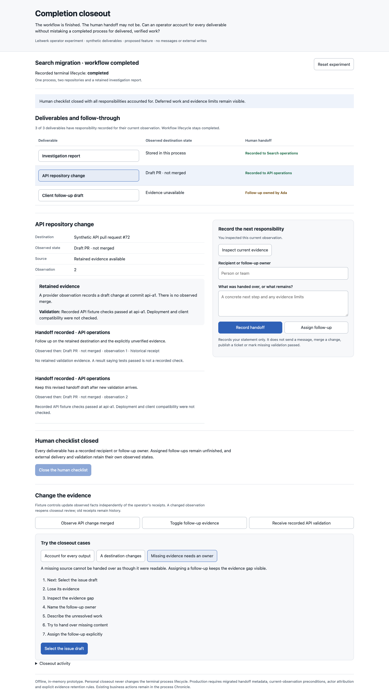
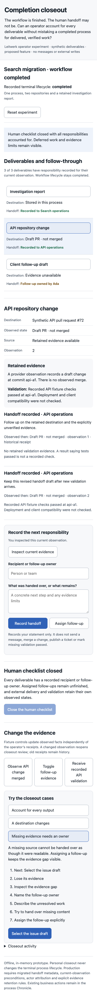

# Completion closeout

A completed process can leave an unmerged change, a useful report or an unfinished follow-up. This prototype asks whether an operator can account for each deliverable without treating workflow completion as proof of external delivery, validation or human acceptance.

Open `index.html` directly in a browser. Everything runs offline with synthetic, in-memory state. Reset or reload restores the fixture. Recording a receipt does not contact its named recipient.

This differs from the first batch's review evidence packet: it records who receives outputs and who owns remaining work after the process is terminal. It also differs from acceptance-criteria review, which supports a decision while the process still offers a revision action.

## Interactions

Select a deliverable and inspect its recorded destination and evidence limits. Name a recipient and describe the handoff, or assign a concrete follow-up owner. A handoff requires available source evidence; an owned follow-up can explicitly cover an unavailable source. Every receipt retains the observation and evidence limits that applied when it was recorded.

The human checklist closes when each deliverable has a current handoff or owned follow-up. Assigned follow-ups remain unfinished. Closing this checklist does not merge PRs, publish issues, mark tests passed or alter the process's `completed` lifecycle.

Three guided cases exercise a partial handoff with an appropriately refused early close, a destination changing while a handoff draft is open, and missing evidence that requires an explicit owner. Free play can finish the entire closeout, add later validation observations and recheck stale receipts. Selection changes and rejected submissions preserve per-deliverable drafts.

## Integration seams and proposed contracts

- `packages/ui/src/chronicle/components/ChronicleTerminalSummary.svelte`: the current terminal summary is the natural entry into closeout, while retaining its existing lifecycle meaning.
- `packages/domain/src/domain-model.ts`: `ProcessInstance.lifecycleStatus`/`closedAt` and `ProcessProject.externalUrl` anchor terminal state and known destinations.
- `packages/server/src/process-inspection-reader.ts`: retained output and validation evidence remain associated with exact executions.
- `packages/server/src/routes/ticket-creation.ts`: a supported operator-created issue draft can carry explicit unfinished follow-up; opening or recording a draft is not ticket publication.
- `docs/operator-guide.md`: durable results, independent derived drafts and external-write boundaries define the operational semantics.

Production would require migrated receipt metadata, actor attribution, source-observation preconditions and explicit retention/redaction behavior. Provider observations remain authoritative for external state. The prototype's counter is only a synthetic precondition; it is not an existing API field. Destination labels stand in for real resource links, and no live provider is queried.

## Observed validation

Biome, extracted JavaScript syntax and diff checks passed. Real Chromium interactions completed all three guided cases with per-step assertions. Free play closed all three responsibilities, kept a missing-source follow-up visibly assigned, preserved the completed lifecycle and unmerged PR state, reopened review after new validation, retained the handoff draft through a stale rejection, and preserved the original receipt's missing-validation statement after a new receipt was added.

Desktop 1440px and mobile 390px screenshots were opened and visually inspected. Mobile document width was 390px with no horizontal overflow; browser errors were empty. The detector ran once in degraded regex mode with no findings. It could not evaluate computed contrast because its parser dependencies were unavailable.

Scoped standalone-helper checks apply. No application code, dependencies or runtime/build configuration changed; local application `test:full` was not run.

## Provisional learning and limits

Separate columns for observed destination state and human responsibility make it possible to close administrative follow-through without making a draft PR look merged. Requiring a current observation before recording a receipt exposes changed evidence while preserving the earlier record.

The model has three fixed deliverables and one synthetic operator. It provides no messaging, delivery guarantee, real access control, provider integration or durable audit store. A follow-up owner is a recorded operator statement, not evidence that the named person accepted the work.

Mobile screenshot

